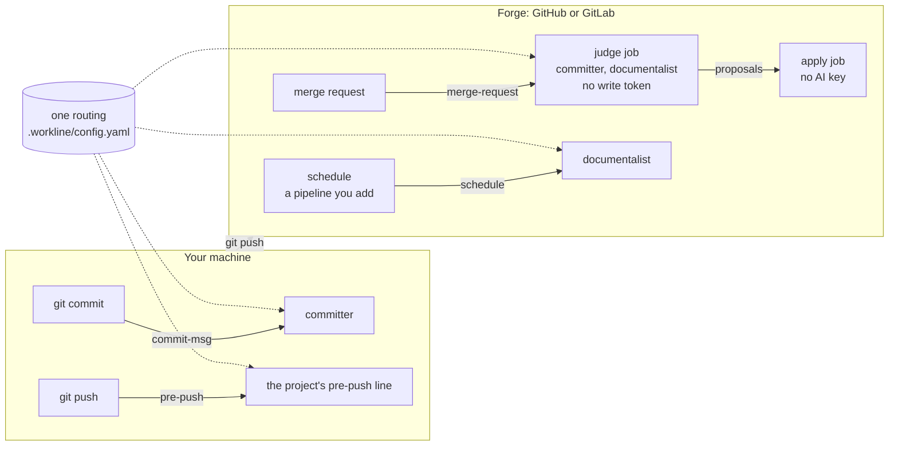

<!-- workline
sources: [cmd/workline, ci, routing.default.yaml, internal/forge, internal/agent/agent.go]
checked: 5b8b173
-->
<h1>
  <picture>
    <source media="(prefers-color-scheme: dark)" srcset="docs/assets/logo-dark.svg">
    
  </picture>
</h1>

A software factory for AI-assisted development: each role — committer, release
manager, documentalist… — does one job with only the context it needs, tools do
the mechanical work, and an AI is called only when a decision needs judgement.
Everything keeps working without AI.

Status (2026-09-24): used daily on its author's machine;
<!-- workline:derive conformance-cases -->59<!-- workline:end --> conformance cases green in CI.

| Works | Not yet |
|---|---|
| **Committer**: checks every commit (global git hook) and every commit of a merge request; Claude rewrites refused messages | |
| **Release manager**: semver, calver, several packages in one repository, generated changelog, tag, forge release | the merge-request flow, build metadata |
| **Documentalist**: finds docs whose sources changed (code, sections, other repositories); cuts cascades; size budgets, duplicates, dead links inside the repository, identifiers gone from the code; Claude judges suspect docs, and its patches are checked | links to other sites, freshness, derived blocks, condensing and splitting by AI |
| **Gates**, **routing** and handoffs, on a machine or judged on a forge and applied later | |
| **Work items** (local files or forge issues): the check that moves one to `ready` | the rest of the item's life |
| **Forges**: GitHub (comments and labels tried live), simulated; GitLab written | GitLab never run; GitHub issues and releases never run live |
| Agents: Claude Code | Codex, Antigravity, OpenCode; the generated model grid |

## Try it

```sh
go build -o ~/.local/bin/workline ./cmd/workline

workline hooks install --global     # check every commit message on this machine
workline hooks uninstall --global   # give core.hooksPath back as it was
```

Each global hook hands over to the one that held `core.hooksPath` before, or,
when there was none for that hook, to the repository's own (`.githooks/`,
`.git/hooks/`): nothing that ran before stops running. A repository opts out
with an empty `.workline/off` file.

By default no AI is used: a refused message is explained, and you rewrite it.
To let Claude Code rewrite it, add `ai: claude` to `~/.config/workline/config.yaml`
(your default) or to a project's `.workline/config.yaml` (which wins).

## Where it runs

On your machine, on a forge, or both: each place fires its own events, and one
routing (`routing.default.yaml`, changed in `.workline/config.yaml`) says which
roles each event runs. A role behaves the same wherever it runs; only the
trigger, the agent at hand and the way proposals are applied differ.



| Event | Fired by | Roles by default |
|---|---|---|
| `commit-msg` | your machine: the global git hook | committer |
| `pre-push` | your machine, before the commits leave it, if the project routes it | none by default; workline itself: committer, documentalist |
| `merge-request` | the forge: [GitHub Actions](ci/github/workline.yml) or [GitLab CI](ci/gitlab/workline.gitlab-ci.yml) template | committer, documentalist |
| `schedule` | you, or a scheduled pipeline you add (the templates have none yet) | documentalist |
| `release` | wherever you run `workline route release`: it tags and publishes at once (`flow: direct`) | release-manager |

So the committer checks your messages as you write them, and again on the merge
request for those without the hook; the documentalist runs on the forge. On a
forge, one job judges without a write token and another applies without an AI
key (`--no-apply`, then `workline apply`).

The CI templates run `workline route merge-request`, so a project's `routing:`
reaches its CI too.

## Take only a part

workline is one binary with its roles inside, and needs nothing but git (and
`gh` or `glab` to reach a forge). Any existing pipeline can call one role, and
leave the rest:

```sh
workline run-role committer --event merge-request --ai none \
  --input range=origin/main..HEAD --json    # exit code: 0 pass, 1 block, 2 human, 3 external
workline run-role documentalist --event schedule --ai none --json
workline gate release --json   # a gate declared in .workline/config.yaml: your scanners' SARIF, with thresholds
```

- The exit code carries the verdict; `--json` gives the findings to whatever
  reads them.
- The global hook hands over to the hooks that were there before; nothing
  stops running.
- `--no-apply` and `workline apply` fit a pipeline that keeps tokens apart.
- A role is a folder (`role.yaml`, facets, `pre` and `post` in any language):
  a team can replace one facet (`.workline/roles/<role>/`), or run its own
  roles with `--roles <dir>` ([role contract](docs/spec/role-contract.md)).

Not there yet: verdicts as SARIF, for code-scanning and code-quality views;
an agent other than Claude Code, or any command given as the agent.

## Develop

```sh
go test -count=1 ./...    # unit tests and the conformance suite
```

`-count=1` matters: the conformance suite builds the engine itself, which Go's
test cache does not see. The evaluation grades the roles with a real agent on
real cases, and costs tokens, so it runs only when asked:
`WORKLINE_EVAL=claude go test -count=1 -timeout 60m ./tests/evaluation/`
(docs/spec/conformance.md, "Evaluation").

## Read next

- [Usage](docs/usage.md) — commands, options, exit codes, files, variables
- [Principles](docs/PRINCIPLES.md) — the rules every choice is checked against
- [Role contract](docs/spec/role-contract.md) — what a role is
- [Decisions](docs/adr/) · [Research](docs/research/) · [Backlog](docs/BACKLOG.md)
