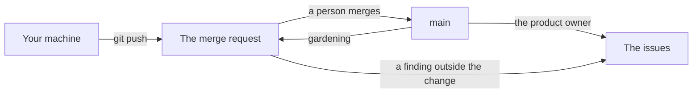

<!-- workline
sources: [cmd/workline, ci, routing.default.yaml, internal/forge, internal/agent/agent.go, internal/gate]
checked: 9e31d4b
judged: 14f0db4
verified: agent:documentalist
-->
<h1>
  <picture>
    <source media="(prefers-color-scheme: dark)" srcset="docs/assets/logo-dark.svg">
    
  </picture>
</h1>

A software factory for AI-assisted development:

- each role — committer, documentalist… — does one job, with only the
  context it needs;
- tools do the mechanical work; an AI is called only when a decision
  needs judgement;
- everything keeps working without AI;
- people state the need and accept the result; the line does the work in
  between ([principles](docs/PRINCIPLES.md)).

Status (2026-10-06): runs on every commit of its author, and in CI on the
pull requests and nightly gardening of workline and of another project;
<!-- workline:derive conformance-cases -->570<!-- workline:end --> conformance cases green in CI.

## Get started

- **Install** the binary, then `workline setup`: the global hooks, your
  agent, the tools the roles use ([install](docs/install.md#on-your-machine)).
- **Choose your agent**: none, Claude Code, or any command as `cmd:`
  ([the choice](docs/install.md#3-the-agent-your-choice)).
- **Adopt a repository**: `workline init`
  ([install](docs/install.md#5-adopt-a-repository)).
- **Add CI**: the GitHub or GitLab templates ([install](docs/install.md#in-ci)).
- Step by step, in ten minutes: [the quickstart](docs/quickstart.md).

## Documentation

| Start here | Use it | Go further |
|---|---|---|
| [Install](docs/install.md) — your machine, then CI | [Roles](docs/roles.md) — what each does and not, its settings | [Principles](docs/PRINCIPLES.md) |
| [Quickstart](docs/quickstart.md) — ten minutes, on your machine | [Usage](docs/usage.md) — commands, options, exit codes | [Role contract](docs/spec/role-contract.md) — what a role is |
| [Concepts](docs/concepts.md) — the words used everywhere | [Configuration](docs/config.md) — settings, files, variables | [Decisions](docs/adr/) · [Research](docs/research/) |
| [Troubleshooting](docs/troubleshooting.md) | [CI](docs/ci.md) — [GitHub](docs/ci-github.md), [GitLab](docs/ci-gitlab.md), [other forges, none](docs/ci-other-forges.md) | [Backlog](https://github.com/JN0V/workline/issues) |
| [Contributing](CONTRIBUTING.md) — build, test, commits | [Any trigger](docs/triggers.md) · [GitLab, started by a tool](docs/gitlab-trigger.md) · [Only a part](docs/parts.md) | |

## The roles

| Role | What it does for you | [Status](docs/adr/0036-a-roles-status-is-earned-by-written-criteria.md) |
|---|---|---|
| [**Committer**](roles/committer/README.md) | checks each commit's message, the secrets it adds and its author | [beta](roles/committer/docs/status.md) |
| [**Documentalist**](roles/documentalist/README.md) | keeps the docs true to the code they name | [beta](roles/documentalist/docs/status.md) |
| [**Reviewer**](roles/reviewer/README.md) | reads a change before a person does and says what it breaks; never approves | [beta](roles/reviewer/docs/status.md) |
| [**Product owner**](roles/product-owner/README.md) | keeps the open issues true to the code, refined and in order | [beta](roles/product-owner/docs/status.md) |
| [Judge](roles/judge/role.yaml) | answers one yes-or-no question for the other roles, from another context or model | [beta](roles/judge/docs/status.md) |
| [Auditor](roles/auditor/role.yaml) | re-checks a weekly sample of the roles' acts (the docs' today) | [beta](roles/auditor/docs/status.md) |
| [Inspector](https://github.com/JN0V/workline/issues/202) | will post the static-analysis findings a merge request adds | planned |
| [Security](https://github.com/JN0V/workline/issues/204) | will add security scanners as gates and a security lens | planned |
| [Process engineer](https://github.com/JN0V/workline/issues/89) | will read the line's measures and propose fixes | planned |
| [Tester](https://github.com/JN0V/workline/issues/206) | will write an issue's tests first, kept from the developer | planned |
| [Architect](https://github.com/JN0V/workline/issues/207) | will read specs for structure and keep architecture rules | planned |
| [UX](https://github.com/JN0V/workline/issues/208) | will check accessibility and flows, for projects with a user interface | planned |
| [PM](https://github.com/JN0V/workline/issues/209) | will map the product and suggest functions | planned |
| [Developer](https://github.com/JN0V/workline/issues/117) | will take a ready issue and open the pull request, last | planned |

- What each role does and does not, its settings and costs: its page, or
  [all the roles](docs/roles.md).
- A planned role links to its issue, which holds its design.
- The auditor widening to every role: [#205](https://github.com/JN0V/workline/issues/205).
- Why these roles, in this order: the
  [roles panorama](docs/research/roles-panorama.md).

## Where it runs

- One routing says which roles each event runs: `routing.default.yaml` as
  shipped, changed in `.workline/config.yaml`.
- A role behaves the same wherever it runs; only the trigger, the agent at
  hand and how its proposals are applied differ.
- On a forge, one job judges, with the agent and no write token; another
  applies, with the write token and no AI key.
- Forges: GitHub and GitLab built in; none (`forge: local`, kept in the
  clone); any other through a command (`cmd:`, a Forgejo and Gitea sample,
  untried on a live instance).


```mermaid
flowchart LR
  machine["Your machine"]
  mr["The merge request"]
  main["main"]
  issues["The issues"]
  machine -- git push --> mr
  mr -- a person merges --> main
  main -- gardening --> mr
  main -- the product owner --> issues
  mr -- a finding outside the change --> issues
```

Each role, from a hook, a script or a CI job: [triggers](docs/triggers.md).

### Your machine

| When | Roles | Agent |
|---|---|---|
| `git commit` (the global hook) | committer | yours, to rewrite a refused message |
| `git push` (the global hook, once `workline init` routes it) | committer; documentalist, counting the docs made suspect | never |
| `workline review` | reviewer, before you push | yours |
| `workline review --spec <file>`, `--issue <n>` | reviewer, on a spec before it is built | yours |
| `workline docs` | documentalist: fixes the docs made suspect, you keep or drop each | yours |

### The merge request

| What | Roles | Writes |
|---|---|---|
| each push to it | committer; documentalist; reviewer, opt-in | the docs' fix on its branch; one summary comment; the findings in the forge's code-scanning view; the job's summary |
| a release tool's (release-please…) | documentalist, on the docs due at the release | the docs' fix in a merge request of its own |
| a fork's | judged with no agent | on GitHub, a comment; on GitLab, nothing |

- The review is on the merge request; a person merges.
- Templates: [GitHub Actions](ci/github/workline.yml) and
  [its fork job](ci/github/workline-fork.yml),
  [GitLab CI](ci/gitlab/workline.gitlab-ci.yml). Setting up:
  [CI](docs/ci.md).

### main: schedules and releases

| When | Roles | Writes |
|---|---|---|
| gardening, nightly or weekly (`workline route schedule`) | documentalist; product owner, opt-in | one merge request per task; the issues |
| the weekly sample (`workline sample`) | auditor: a second look at one doc in ten the documentalist confirmed; the product owner's acts, drawn for a person | one issue, a comment a week; a merge request undoing a wrong confirmation |
| each push to main (`workline follow`) | the engine, no agent: rebuilds the documentalist's release fix on main's new tip | its merge request, force-pushed |
| before your release tool tags (`workline route release`) | documentalist, on the docs due at the release | a non-zero exit holds the release |

- workline cuts no releases: it runs before your release tool.
- Templates: GitHub's [gardening](ci/github/workline-gardening.yml) and
  [sample](ci/github/workline-sample.yml), `follow` in
  [workline.yml](ci/github/workline.yml); on GitLab, two pipeline
  schedules and a push to the default branch, all in the same
  [template](ci/gitlab/workline.gitlab-ci.yml).
- Each command in detail: [usage](docs/usage.md#commands).

### The issues

| Who | What |
|---|---|
| product owner, on gardening | reads a share of the open issues against the code: duplicates, obsolete, refined to `ready`, split, ordered; one report issue |
| `workline issues import <file>` | a roadmap file to issues |
| reviewer | a finding outside the change: an issue, `needs-triage` |
| documentalist | the code disagrees with a decision a doc records: an issue |
| a person | accepts: the label `workline:accepted`, a parent closed |

## Gates

- A gate is a checkpoint before merging or releasing: it runs your tools
  and gives a verdict by rules, never by asking a model.
- Your tools, your thresholds: any command; its exit code, or its results
  in SARIF (the common format of static-analysis tools) counted against a
  `max` set before it runs.
- Three outcomes for each check: **pass**, **finding**, or **error** — a
  tool missing, crashed or unreadable fails the gate, never passes it
  (an `optional` check is still reported).
- Run with `workline gate <name>`, or as `gate:<name>` in a routing
  sequence.

```yaml
gates:
  release:
    checks:
      - {id: load, run: k6 run load/checkout.js, output: exit}
      - {id: deps, run: "osv-scanner scan --format sarif --output {out}/deps.sarif .", output: sarif, max: {error: 0}}
```

- Everything else: [the gates spec](docs/spec/gates.md).
- Not built yet: a merge request's new findings only, posted on it
  ([#202](https://github.com/JN0V/workline/issues/202)); a SonarQube
  quality gate read, never rerun
  ([#203](https://github.com/JN0V/workline/issues/203)); other outputs
  (k6 or benchmark JSON); baselines with an expiry date.
