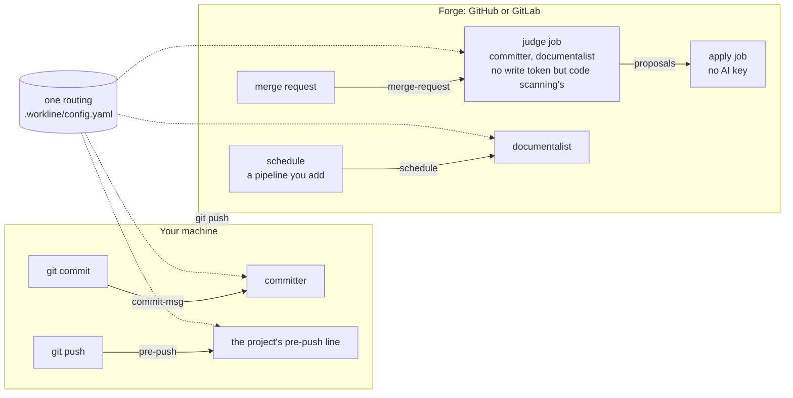

<!-- workline
sources: [cmd/workline, ci, routing.default.yaml, internal/forge, internal/agent/agent.go]
checked: 810dd7d
judged: 9ad8c58
verified: agent:claude-code
-->
<h1>
  <picture>
    <source media="(prefers-color-scheme: dark)" srcset="docs/assets/logo-dark.svg">
    
  </picture>
</h1>

A software factory for AI-assisted development: each role — committer,
documentalist… — does one job with only the context it needs, tools do
the mechanical work, and an AI is called only when a decision needs judgement.
Everything keeps working without AI.

Status (2026-09-24): used daily on its author's machine;
<!-- workline:derive conformance-cases -->405<!-- workline:end --> conformance cases green in CI.

| Works | Not yet |
|---|---|
| [**Committer**](roles/committer/README.md): checks every commit (global git hook) and every commit of a merge request; Claude rewrites refused messages; secrets and forbidden terms in changes and messages (gitleaks), author identity | |
| [**Documentalist**](roles/documentalist/README.md): finds docs whose sources changed (code, sections, other repositories); cuts cascades; size budgets, duplicates, dead links inside the repository and, when gardening, to other sites (lychee), identifiers gone from the code; docs citing a superseded decision; docs not confirmed for too long; derived blocks, regenerated on the default branch so parallel branches never conflict on them (ADR-0027); Claude judges suspect and stale docs, opens an issue when the code disagrees with a spec, brings product docs up to date at the release, which waits for them, merges a repeated passage and a card too short, condenses a doc over budget, splits a card holding several concepts (checked by a second model), and its patches are checked | style |
| [**Product owner**](roles/product-owner/README.md) (beta): reads the open issues against the code; closes a duplicate, its original quoted, up to a cap a run; announces on the issue what the code made obsolete, and closes it a week later if nobody wrote and a second judge agrees (ADR-0024); names an issue's code, sets milestones; refines an issue to `ready` (Need and Validation drafted for a person) and asks its reporter what is missing; splits a need too big for one issue into sub-issues and renames a vague title (ADR-0022), then says on the parent, as its parts close, what each delivered and which items of its Verification are proved, for a person to accept — never closing it (ADR-0029); orders the backlog, an issue that waits on another after it and never offered first, the link in the forge's own relation or a line in the body (ADR-0028); imports a roadmap file as issues; keeps the one way every role opens an issue, a subject open or closed never opened twice; a closing undone puts that act back to a person (ADR-0018). Nightly in DomoticsCore's CI | asking again after an answer |
| [**Reviewer**](roles/reviewer/README.md) (beta): reviews a branch before the push (`workline review`) and, opt-in, each merge request; rules on the comments a change adds (a bug's story, an internal code), then lenses (correctness, edge cases, tests) whose quotes the engine finds again; a finding whose cause lies in the change goes to its author, one outside it to an issue; each important one checked by a judge, the independence said; never approves nor patches (ADR-0020) | specs, the developer's loop, inline comments |
| **Gates**, **routing** and handoffs, on a machine or judged on a forge and applied later | |
| **Work items** (local files or forge issues): the check that moves one to `ready` | the rest of the item's life |
| **Forges**: GitHub (comments, a comment edited in place, labels and issues tried live), simulated; GitLab tried on gitlab.com (a project access token, its members told from outsiders); none, kept in the clone (`forge: local`, `workline issues`); any other plugged by a command (`cmd:`, a Forgejo and Gitea sample) — ADR-0016; findings as SARIF in code scanning (this repository's, from CI) and as GitLab's Code Quality report | a fork's merge request on GitLab CI; the Forgejo sample untried on a live instance |
| Agents: Claude Code, and any command as `cmd:` | Codex, Antigravity, OpenCode built in; the generated model grid |

## Install

You need git. Each [release](https://github.com/JN0V/workline/releases)
holds the binary for Linux, macOS and Windows; on Linux or macOS, into
`~/.local/bin`:

```sh
os=$(uname -s | tr A-Z a-z); arch=$(uname -m | sed 's/x86_64/amd64/; s/aarch64/arm64/')
curl -fsSL "https://github.com/JN0V/workline/releases/latest/download/workline_${os}_${arch}.tar.gz" | tar -xz -C ~/.local/bin workline
workline version
```

Or, with [Go](https://go.dev/dl/) 1.21 or later, which puts it in
`$(go env GOPATH)/bin`, usually `~/go/bin` (add it to your `PATH`):

```sh
go install github.com/JN0V/workline/cmd/workline@latest
```

To update, run the same command again, into the same place: the global
hooks call the binary where it was when they were installed (`command -v
workline` says where). Then set up this machine:

```sh
workline setup    # asks, then does: the global hooks, your agent, the tools the roles use
```

It asks whether to check every commit (the global hooks, below), which agent
judges (none, or Claude Code: below), and installs the tools the roles use —
gitleaks for secrets, the `claude` CLI — each with the command it shows
first. Run it again to change your answers; `--yes` takes the defaults. It
ends with `workline doctor`, which says at any time what is set up and what
is missing, each with the command that sets it up.

In a repository, `workline init` has the committer and the documentalist run
before each push, and, with an agent, proposes for each doc the code it
describes, for you to review and commit: until a doc names its `sources`,
nothing tells when it goes wrong. `--review` has the reviewer read each merge
request's code too; `workline review` reads a branch's before you push it.
It asks whether a person is the project's Product Owner: if so, the product
owner role proposes what sets direction rather than doing it
(`autonomy: cautious`, ADR-0026).

### Check every commit on this machine

`workline setup` does this when you say yes; by hand:

```sh
workline hooks install --global     # git's global core.hooksPath now goes through workline
workline hooks uninstall --global   # gives core.hooksPath back as it was
```

Each global hook hands over to the one that held `core.hooksPath` before, or,
when there was none for that hook, to the repository's own (`.githooks/`,
`.git/hooks/`): nothing that ran before stops running. A repository opts out
with an empty `.workline/off` file.

Try it in any repository:

```sh
git commit --allow-empty -m "AC-3 fix the thing"
# workline committer: block — rewrite the commit message
#   format subject: the subject must read `type(scope): summary`…
```

### Let an AI rewrite what is refused (optional)

By default no AI is used: a refused message is explained, and you rewrite it.
To let an AI rewrite it (`workline setup` installs Claude Code and does step
2; you still log in once):

1. Install [Claude Code](https://docs.claude.com/en/docs/claude-code/setup),
   run `claude` once and log in (a Claude subscription or an API key). workline
   calls `claude -p` with that login: it holds no key of its own.
2. Tell workline to use it, for all your repositories:

   ```sh
   mkdir -p ~/.config/workline
   echo 'ai: claude' >> ~/.config/workline/config.yaml
   ```

   On macOS the file is `~/Library/Application Support/workline/config.yaml`.
   A project's own `.workline/config.yaml` wins over yours, and
   `WORKLINE_AI=none git commit …` turns the AI off for one commit.

The same commit now goes through, rewritten:

```text
workline committer: pass — message rewritten
workline: the commit goes on with this message instead of yours:
  │ fix: fix the thing
  │
  │ Refs: AC-3
```

Claude Code is the only agent built in (`cmd:<command>` runs any other).

## Where it runs

On your machine, on a forge, or both: each place fires its own events, and one
routing (`routing.default.yaml`, changed in `.workline/config.yaml`) says which
roles each event runs. A role behaves the same wherever it runs; only the
trigger, the agent at hand and the way proposals are applied differ.
Setting it up in CI, on GitHub or GitLab, another forge, or none: [docs/ci.md](docs/ci.md).


```mermaid
flowchart LR
  routing[("one routing<br/>.workline/config.yaml")]
  subgraph machine["Your machine"]
    commit["git commit"] -- commit-msg --> committer1["committer"]
    push["git push"] -- pre-push --> local["the project's pre-push line"]
  end
  subgraph forge["Forge: GitHub or GitLab"]
    mr["merge request"] -- merge-request --> judge["judge job<br/>committer, documentalist<br/>no write token but code scanning's"]
    judge -- proposals --> apply["apply job<br/>no AI key"]
    schedule["schedule<br/>a pipeline you add"] -- schedule --> documentalist["documentalist"]
  end
  machine -- git push --> forge
  routing -.-> committer1
  routing -.-> local
  routing -.-> judge
  routing -.-> documentalist
```

| Event | Fired by | Roles by default |
|---|---|---|
| `commit-msg` | your machine: the global git hook | committer |
| `pre-push` | your machine, before the commits leave it, if the project routes it; no question: the review is on the merge request (a push approval, on the terminal, in the editor or in a dialog, if you ask for it) | none by default; workline itself: committer, documentalist |
| `merge-request` | the forge: [GitHub Actions](ci/github/workline.yml) (with [workline-fork.yml](ci/github/workline-fork.yml) to comment on a fork's) or [GitLab CI](ci/gitlab/workline.gitlab-ci.yml) template | committer, documentalist; the reviewer, opt-in (ADR-0020); workline itself: all three |
| `schedule` | you, or a scheduled pipeline: the [GitHub Actions](ci/github/workline-gardening.yml) or [GitLab CI](ci/gitlab/workline.gitlab-ci.yml) template, each task a merge request of its own (ADR-0006) | documentalist |
| `release` | wherever you run `workline route release`, before your release tool (semantic-release…) tags; a release tool's pull request (release-please…) is held as the release on `merge-request`: workline cuts no releases (ADR-0017) | documentalist (docs due at the release) |

So the committer checks your messages as you write them, and again on the merge
request for those without the hook; the documentalist runs on the forge. On a
forge, one job judges with no write token but code scanning's (SARIF upload) and
another applies without an AI key (`--no-apply`, then `workline apply`).

The CI templates run `workline route` (`merge-request`; `schedule` for the
gardening ones), so a project's `routing:` reaches its CI too.

## Documentation

| Start here | Use it | Go further |
|---|---|---|
| [Quickstart](docs/quickstart.md) — ten minutes, on your machine | [Roles](docs/roles.md) — what each does and not, its settings | [Principles](docs/PRINCIPLES.md) |
| [Concepts](docs/concepts.md) — the words used everywhere | [Usage](docs/usage.md) — commands, options, exit codes | [Role contract](docs/spec/role-contract.md) — what a role is |
| [Troubleshooting](docs/troubleshooting.md) | [Configuration](docs/config.md) — settings, files, variables | [Decisions](docs/adr/) · [Research](docs/research/) |
| [Contributing](CONTRIBUTING.md) — build, test, commits | [CI](docs/ci.md) — GitHub, GitLab, other forges, none | [Backlog](https://github.com/JN0V/workline/issues) |
| | [Any trigger](docs/triggers.md) · [GitLab, started by a tool](docs/gitlab-trigger.md) · [Only a part](docs/parts.md) | |
