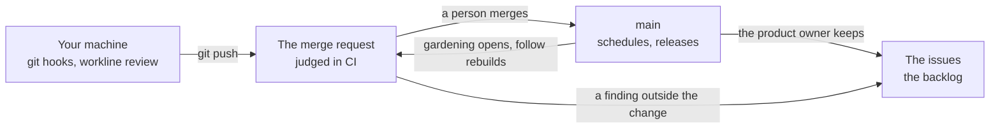

<!-- workline
sources: [cmd/workline, ci, routing.default.yaml, internal/forge, internal/agent/agent.go, internal/gate]
checked: 7a6289b
judged: 9ad8c58
verified: agent:claude-code
-->
<h1>
  <picture>
    <source media="(prefers-color-scheme: dark)" srcset="docs/assets/logo-dark.svg">
    
  </picture>
</h1>

A software factory for AI-assisted development:

- each role — committer, documentalist… — does one job, with only the
  context it needs;
- tools do the mechanical work; an AI is called only when a decision
  needs judgement;
- everything keeps working without AI;
- people state the need and accept the result; the line does the work in
  between ([principles](docs/PRINCIPLES.md)).

Status (2026-10-06): runs on every commit of its author, and in CI on the
pull requests and nightly gardening of workline and DomoticsCore;
<!-- workline:derive conformance-cases -->405<!-- workline:end --> conformance cases green in CI.

## The roles

| Role | What it does for you | Status |
|---|---|---|
| [**Committer**](roles/committer/README.md) | checks each commit's message, the secrets it adds and its author; with an agent, rewrites a refused message | built |
| [**Documentalist**](roles/documentalist/README.md) | keeps the docs true to the code they name: finds the suspect ones, fixes them on the merge request and by gardening | built |
| [**Reviewer**](roles/reviewer/README.md) | reads a change's code before a person does and says what it breaks; never approves | beta |
| [**Product owner**](roles/product-owner/README.md) | keeps the open issues true to the code, refined and in order; a person still accepts | beta |
| [Judge](roles/judge/role.yaml) | answers one yes-or-no question a role's check cannot, from another context or model; asked by the other roles, never on an event of its own | built |
| [Auditor](roles/auditor/role.yaml) | re-checks a sample of every role's acts (docs today): `workline sample` asks it each week, a verdict per act; widening to every role: [#205](https://github.com/JN0V/workline/issues/205) | built (docs) |
| Inspector | will read a merge request's static analysis: only the findings it adds, posted on it, explained by an AI that never changes the verdict ([#202](https://github.com/JN0V/workline/issues/202)); SonarQube read, not rerun ([#203](https://github.com/JN0V/workline/issues/203)) | planned |
| Security | will add scanners as gates and a security lens to the reviewer; a pentest later, on an authorised staging only ([#204](https://github.com/JN0V/workline/issues/204)) | planned |
| Process engineer | will read the line's measures, the auditor's verdicts first, and propose fixes as issues ([#89](https://github.com/JN0V/workline/issues/89), [ADR-0019](docs/adr/0019-the-line-evaluates-itself.md), a draft) | planned |
| Tester | will write an issue's tests from its Verification, red first, kept from the developer ([#206](https://github.com/JN0V/workline/issues/206)) | planned |
| Architect | will read specs for structure and keep architecture rules as gates ([#207](https://github.com/JN0V/workline/issues/207)) | planned |
| UX | for projects with a user interface: accessibility tools as gates, flows read against the need ([#208](https://github.com/JN0V/workline/issues/208)) | planned |
| PM | will map the product, watch similar ones and suggest functions; to design with the maintainer ([#209](https://github.com/JN0V/workline/issues/209)) | planned |
| Developer | will take a ready issue and open the pull request, last ([#117](https://github.com/JN0V/workline/issues/117)) | planned |

What each role does and does not, its settings and costs: its page, or
[all the roles](docs/roles.md). Checking that a commit holds one change is
planned ([#192](https://github.com/JN0V/workline/issues/192)). Why these
roles, in this order: the [roles panorama](docs/research/roles-panorama.md).

## Documentation

| Start here | Use it | Go further |
|---|---|---|
| [Install](docs/install.md) — your machine, then CI | [Roles](docs/roles.md) — what each does and not, its settings | [Principles](docs/PRINCIPLES.md) |
| [Quickstart](docs/quickstart.md) — ten minutes, on your machine | [Usage](docs/usage.md) — commands, options, exit codes | [Role contract](docs/spec/role-contract.md) — what a role is |
| [Concepts](docs/concepts.md) — the words used everywhere | [Configuration](docs/config.md) — settings, files, variables | [Decisions](docs/adr/) · [Research](docs/research/) |
| [Troubleshooting](docs/troubleshooting.md) | [CI](docs/ci.md) — GitHub, GitLab, other forges, none | [Backlog](https://github.com/JN0V/workline/issues) |
| [Contributing](CONTRIBUTING.md) — build, test, commits | [Any trigger](docs/triggers.md) · [GitLab, started by a tool](docs/gitlab-trigger.md) · [Only a part](docs/parts.md) | |

## Get started

- **Install** the binary, then `workline setup`: the global hooks, your
  agent, the tools the roles use ([install](docs/install.md#on-your-machine)).
- **Choose your agent**: none, Claude Code, or any command as `cmd:`
  ([the choice](docs/install.md#3-the-agent-your-choice)).
- **Adopt a repository**: `workline init`
  ([install](docs/install.md#5-adopt-a-repository)).
- **Add CI**: the GitHub or GitLab templates ([install](docs/install.md#in-ci)).
- Step by step, in ten minutes: [the quickstart](docs/quickstart.md).

## Where it runs

- One routing says which roles each event runs: `routing.default.yaml` as
  shipped, changed in `.workline/config.yaml`.
- A role behaves the same wherever it runs; only the trigger, the agent at
  hand and how its proposals are applied differ.
- On a forge, one job judges, with the agent and no write token; another
  applies, with the write token and no AI key.
- Forges: GitHub and GitLab built in; none (`forge: local`, kept in the
  clone); any other through a command (`cmd:`, a Forgejo and Gitea sample,
  untried on a live instance) —
  [ADR-0016](docs/adr/0016-writes-go-where-the-project-lives.md).


```mermaid
flowchart LR
  machine["Your machine<br/>git hooks, workline review"]
  mr["The merge request<br/>judged in CI"]
  main["main<br/>schedules, releases"]
  issues["The issues<br/>the backlog"]
  machine -- git push --> mr
  mr -- a person merges --> main
  main -- gardening opens, follow rebuilds --> mr
  main -- the product owner keeps --> issues
  mr -- a finding outside the change --> issues
```

### Your machine

| When | Event | Roles | Agent |
|---|---|---|---|
| `git commit` | `commit-msg`, the global hook | committer | yours, to rewrite a refused message |
| `git push` | `pre-push`, the global hook, once `workline init` routes it | committer, documentalist: counts the docs made suspect | never |
| `workline review` | `review` | reviewer, before you push | yours |
| `workline docs` | | documentalist: judges the docs made suspect, you keep or drop each fix | yours |

### The merge request

| What | Roles | Writes |
|---|---|---|
| each push to it (`merge-request`) | committer, every commit; documentalist, the docs it made suspect; reviewer, opt-in ([ADR-0020](docs/adr/0020-the-reviewer-finds-the-engine-verifies-the-person-merges.md)) | the docs' fix committed to its branch; one summary comment; findings in code scanning (SARIF) or GitLab's Code Quality |
| a release tool's (release-please…) | held as the release: the documentalist on the docs due ([ADR-0017](docs/adr/0017-the-release-manager.md)) | the docs' fix in a merge request of its own |
| a fork's | judged with no agent | on GitHub, a comment ([workline-fork.yml](ci/github/workline-fork.yml)); on GitLab, nothing |

Templates: [GitHub Actions](ci/github/workline.yml),
[GitLab CI](ci/gitlab/workline.gitlab-ci.yml). The review is on the merge
request, a person merges ([ADR-0011](docs/adr/0011-the-review-is-on-the-merge-request-not-the-push.md)).

### main: schedules and releases

| When | Command | Roles | Writes |
|---|---|---|---|
| gardening, nightly or weekly | `workline route schedule` | documentalist; product owner, opt-in | one merge request per task ([ADR-0006](docs/adr/0006-gardening-opens-one-merge-request-per-task.md)); the issues |
| the weekly sample | `workline sample` | auditor, on one in ten docs vouched for; the product owner's acts drawn for a person, no agent | one issue a sample, a comment a week; a merge request putting back a `checked` found false |
| each push to main | `workline follow` | the engine, no agent: the documentalist's release fix rebuilt on main's new tip; one a person committed to is left alone ([ADR-0034](docs/adr/0034-the-release-fix-follows-its-base.md)) | its merge request, force-pushed |
| before your release tool tags | `workline route release` | documentalist, on the docs due at the release | a non-zero exit holds the release; the fix on `workline/documentalist/release` |

Templates: GitHub's [gardening](ci/github/workline-gardening.yml) and
[sample](ci/github/workline-sample.yml), `follow` in
[workline.yml](ci/github/workline.yml); on GitLab, two pipeline schedules
and a push to the default branch, all in the same
[template](ci/gitlab/workline.gitlab-ci.yml). workline cuts no
releases: it runs before your release tool.

### The issues

| Who | What |
|---|---|
| product owner, on gardening's `schedule` | reads a share of the open issues against the code: duplicates, obsolete issues, refines to `ready`, splits, orders; its report is one issue, "Backlog — product owner" ([ADR-0018](docs/adr/0018-the-product-owner.md)) |
| `workline issues import <file>` | a roadmap file to issues |
| reviewer | a finding outside the change: an issue, `needs-triage` |
| documentalist | the code disagrees with a doc the code follows (a decision): an issue |
| a person | accepts: the label `workline:accepted`, a parent closed |

Each role, from a hook, a script or a CI job: [triggers.md](docs/triggers.md).

## Gates

- A gate is a checkpoint before merging or releasing: it runs your tools
  and gives a verdict by rules, never by asking a model.
- Your tools, your thresholds: any command; its exit code, or its SARIF
  results counted against a `max` set before it runs.
- Three outcomes for each check: **pass**, **finding**, or **error** — a
  tool missing, crashed or unreadable fails the gate, never passes it
  (an `optional` check is still reported).
- Run with `workline gate <name>`, or as `gate:<name>` in a routing
  sequence.

```yaml
gates:
  release:
    checks:
      - {id: load, run: k6 run load/checkout.js, output: exit}
      - {id: deps, run: "osv-scanner scan --format sarif --output {out}/deps.sarif .", output: sarif, max: {error: 0}}
```

- SonarQube, where a team runs it: its quality gate will be read, never
  rerun ([#203](https://github.com/JN0V/workline/issues/203)).
- Everything else: [the gates spec](docs/spec/gates.md).
- Not built yet: only a merge request's new findings, posted on it
  ([#202](https://github.com/JN0V/workline/issues/202)); other outputs (k6 or benchmark JSON); baselines with
  an expiry date.
