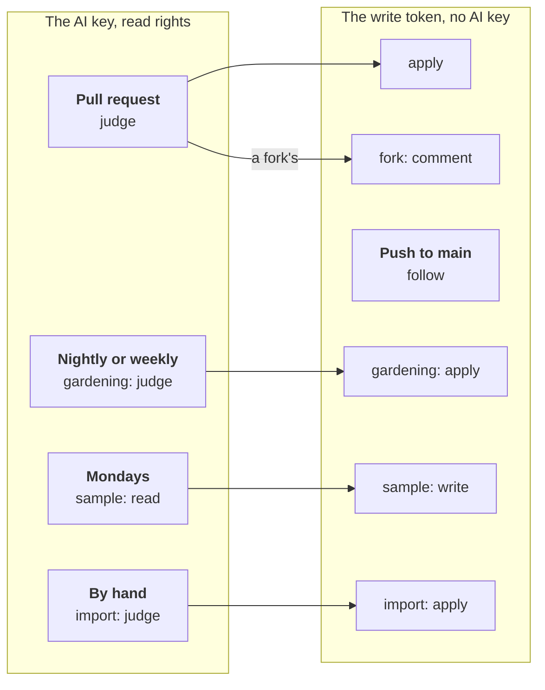

# workline on GitHub Actions



What the jobs are, on every forge: [ci.md](ci.md). This page sets them up
on GitHub. The agent's token reaches only the one step that calls it; a
fork's pull request gets no secret, so no agent and no write.

## Set up

1. **Copy the workflows** into `.github/workflows/`:
   - [workline.yml](../ci/github/workline.yml): `judge` and `apply` on
     each pull request; `follow` on each push to `main`
     ([ADR-0034](adr/0034-the-release-fix-follows-its-base.md)): the
     documentalist's pull request for the release, when one is open, is
     rebuilt on `main`'s new tip, so a pull request merged meanwhile that
     touched the same doc leaves it mergeable; one a person committed to
     is left alone. Rename `main` in its `push:` for another default branch.
   - [workline-fork.yml](../ci/github/workline-fork.yml): comments a fork's
     pull request, which gets no secret and no right to write.
   - [workline-gardening.yml](../ci/github/workline-gardening.yml):
     gardening, nightly while a backlog is caught up, then weekly.
   - [workline-sample.yml](../ci/github/workline-sample.yml): the
     [weekly sample](ci.md#the-weekly-sample), from the first release
     after v0.2.1.
2. **The agent's token**, if you want one: Settings → Secrets and variables
   → Actions → New repository secret. The templates call Claude when
   `CLAUDE_CODE_OAUTH_TOKEN` is set (`claude setup-token`), and no agent
   otherwise; for another agent, change their `--ai` to a `cmd:`.
3. **A GitHub App** commits the fixes, so the checks run again by
   themselves (with the job's own token, GitHub waits for someone to
   approve them):
   - your settings → Developer settings → GitHub Apps → New GitHub App: no
     webhook; repository permissions **Contents**, **Pull requests** and
     **Issues**, read and write;
   - generate a private key, install the App on the repository;
   - in the repository: variable `WORKLINE_APP_ID` (the App's ID), secret
     `WORKLINE_APP_PRIVATE_KEY` (the whole `.pem`);
   - without an App, gardening needs Settings → Actions → General → "Allow
     GitHub Actions to create and approve pull requests".
4. **Protect main** (Settings → Rules): pull requests only, the `judge`
   check required (workline.yml's verdict). The review is on the pull
   request ([ADR-0011](adr/0011-the-review-is-on-the-merge-request-not-the-push.md)):
   an agent never merges.
5. **A private repository** without GitHub Advanced Security: remove the
   `upload-sarif` step of workline.yml, code scanning being paid there.

Then open a pull request changing code a doc describes: `judge` judges it,
and the App commits the fix to its branch, `Workline-Role: documentalist`.

## What the jobs may do

- `judge` reads the code and the pull request (`pull-requests: read`: the
  reviewer reads its own summary comment, to review only new commits);
  it writes only code scanning's SARIF.
- `apply`, `follow` and each pair's second job hold the write token, the
  App's when there is one, and no AI key.
- `apply` runs when `judge` failed too (`if: always()`): a pull request
  the reviewer holds still gets its comment ([#226](https://github.com/JN0V/workline/issues/226)); the workflow fails
  by `judge`'s verdict.
- The product owner's issues: read when judging, write when applying —
  the gardening template gives both.
- **The sample**: the judge is the repository variable `WORKLINE_JUDGE`,
  or the `sample.judge` setting; for another week than the last whole one,
  run the workflow by hand (Actions → workline sample → Run workflow) with
  its `week` input (`2026-W40`).
- **The summary**: the job's summary page (`$GITHUB_STEP_SUMMARY`); a
  fork's pull request gets it as a comment
  ([what a job shows](ci.md#what-a-job-shows)).

## Importing a file

A workflow run by hand (Actions → Run workflow), the steps that install the
engine and the agent as in workline-gardening.yml
([importing a file](ci.md#importing-a-file)):

```yaml
on: {workflow_dispatch: {inputs: {file: {required: true}}}}
permissions: {}
env: {WORKLINE_RUNS_DIR: "${{ github.workspace }}/.workline-runs"}
jobs:
  judge:                                   # the agent, a read token
    runs-on: ubuntu-latest
    permissions: {contents: read, issues: read}
    steps:
      - uses: actions/checkout@v4
      # + the engine and the agent
      # AGENT: your choice — claude, claude:<model>, cmd:<command> (another agent, its own install and token)
      - env: {AGENT: claude, GH_TOKEN: "${{ github.token }}", CLAUDE_CODE_OAUTH_TOKEN: "${{ secrets.CLAUDE_CODE_OAUTH_TOKEN }}", FILE: "${{ inputs.file }}"}
        run: workline issues import "$FILE" --ai "$AGENT" --forge github --summary "$GITHUB_STEP_SUMMARY" --json > line.json
      - uses: actions/upload-artifact@v4
        if: always()
        with: {name: workline-import, path: "line.json\n.workline-runs", include-hidden-files: true}
  apply:                                   # the write token, no agent
    needs: judge
    if: always()
    runs-on: ubuntu-latest
    permissions: {contents: read, issues: write}
    steps:
      - uses: actions/checkout@v4
      # + the engine
      - uses: actions/download-artifact@v4
        with: {name: workline-import}
      - env: {GH_TOKEN: "${{ github.token }}"}
        run: workline apply --line line.json --summary "$GITHUB_STEP_SUMMARY"
```

## workline's own workflows

workline's .github/workflows/ are the templates, but for the engine:

- they build it from the commit they run on rather than run a release:
  gardening and the sample, both jobs, from `main`; a pull request's
  `judge`, from its commit; `follow`, from `main`'s commit, merged and
  reviewed;
- a project never runs, in a commit's checks, the pin that commit ships: a
  pull request moving the templates to a version not yet tagged would
  download nothing, as on each release from v0.2.0 to v0.2.3
  ([ADR-0017](adr/0017-the-release-manager.md));
- a pull request's `apply`, which holds the write token, runs the last
  release of workline holding its engine, looked up when it runs: a change
  to the engine never runs with that token before it is released.

**How workline releases** ([ADR-0017](adr/0017-the-release-manager.md)),
with release-please, never a tag by hand:

- on each push to `main`, release-please.yml, with the App's token, keeps
  one pull request open, "chore(main): release X": the next version from
  the conventional commits since the last tag (`feat` moves the minor
  while workline is at 0.x, as a breaking change does), [CHANGELOG.md](../CHANGELOG.md), and
  the templates' `WORKLINE_VERSION`, each on a line marked
  `x-release-please-version` (release-please-config.json);
- the App's token, not the job's: a pull request opened with
  `GITHUB_TOKEN` starts no workflow, so its checks would never run;
- on that pull request, workline.yml holds it as the release: `judge`
  passes the branch it comes from (`--branch`), and the documentalist
  holds it on every doc made suspect since the last release; its fix goes
  to a pull request of its own on `main`, which `follow` rebuilds at each
  push there, as release-please does its own;
- the person merges it: that is the decision. release-please tags the
  merged commit `vX.Y.Z` and writes the release with its notes; in the
  same run, release.yml builds the binaries with GoReleaser, which uploads
  them and keeps the notes (`release.mode: keep-existing`), and pushes the
  image;
- a failed publish is run again from the Actions page, never tagged again:
  a tag pushed is never moved (the Go proxy keeps its first commit).
