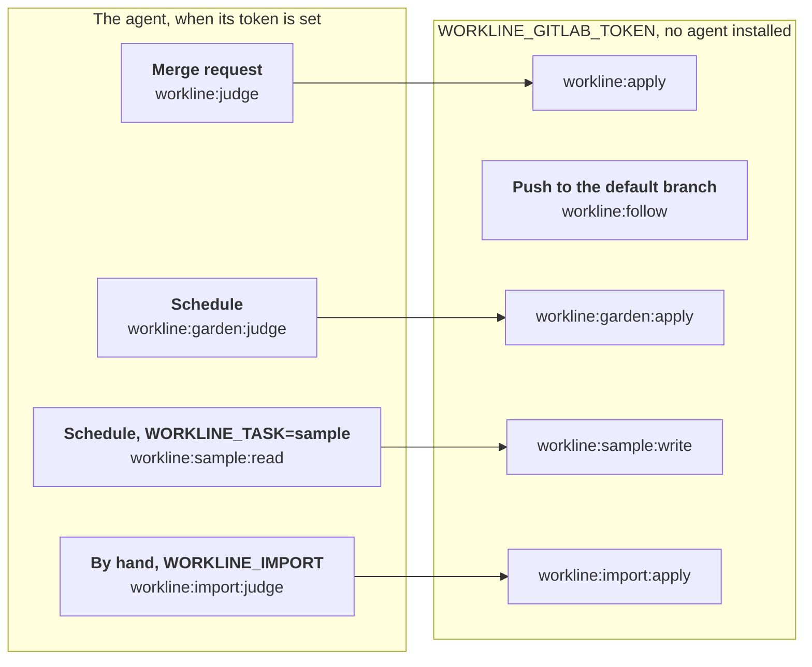

# workline on GitLab CI



What the jobs are, on every forge: [ci.md](ci.md). This page sets them up
on gitlab.com, then on a self-managed instance. A tool starting the
pipelines instead (trigger API, pipelines API, another pipeline):
[gitlab-trigger.md](gitlab-trigger.md).

GitLab gives every variable to every job: the template keeps the write
token out of the judging jobs' commands, not out of their reach — and
gardening's judge reads the open merge requests with it. The agent is
installed only in the judging jobs.

## gitlab.com

1. **Include the template**: copy
   [ci/gitlab/workline.gitlab-ci.yml](../ci/gitlab/workline.gitlab-ci.yml)
   to `ci/` and add to `.gitlab-ci.yml`:

   ```yaml
   stages: [test, deploy]
   include: {local: ci/workline.gitlab-ci.yml}
   ```
2. **The variables**, Settings → CI/CD → Variables, **masked** and **not
   protected** — GitLab gives a protected variable only to protected
   branches, never to a merge request's:
   - `WORKLINE_GITLAB_TOKEN`: a project access token — a bot user of this
     project only ([ADR-0023](adr/0023-the-project-bot-keeps-a-gitlab-backlog.md)) —,
     role Developer, scopes `api` and `write_repository`. One command makes
     it and stores it, never shown (glab, logged in as a Maintainer):

     ```sh
     glab token create workline --repo <group/project> --access-level developer \
       --scope api --scope write_repository --duration 8760h \
       | glab variable set WORKLINE_GITLAB_TOKEN --masked --repo <group/project>
     ```

     Or Settings → Access tokens → Add new token, the same role and scopes,
     then the variable. It expires within a year: rotate it the same way
     (`glab variable update`).
   - Where project access tokens are not offered (GitLab documents them as
     Premium on gitlab.com; one was made on a Free user's project,
     2026-10-05): a personal access token, `api` and `write_repository`,
     of an account made for the line, added to the project as Developer.
     The job's own `CI_JOB_TOKEN` reaches no issue: it is never enough.
   - `CLAUDE_CODE_OAUTH_TOKEN`, if you want Claude to judge
     (`claude setup-token`). Unset, the jobs run with no agent; for
     another, change the template's `--ai` to a `cmd:`.
   - Anyone who may push a branch can read them from a pipeline they
     change: people who may already write to the repository.
3. **Gardening**: Build → Pipeline schedules → New schedule, nightly or
   weekly, on main.
4. **The [weekly sample](ci.md#the-weekly-sample)**: a second schedule,
   weekly, with the variable `WORKLINE_TASK` set to `sample`.
   - A schedule's variables need Settings → CI/CD → Variables, "Minimum
     role to use pipeline variables", at **Maintainer**: a new gitlab.com
     project allows no one, and setting the variable is refused (403, "not
     authorized to set pipeline schedule variables").
   - The judge: the variable `WORKLINE_JUDGE`, or the `sample.judge`
     setting. Another week than the last whole one: set
     `WORKLINE_SAMPLE_WEEK` (`2026-W40`) on the schedule, then play it.
5. **Protect main**: merge requests only, pipelines must succeed.

gitlab.com runs a schedule at its own interval, not at the minute written:
a cron off the hour (`13 17 * * *`) was listed as due at 18:00 and ran at
18:08. Expect it within the hour after.

## What the template does

- **The whole history** (`GIT_DEPTH: 0`, over the project's "Git shallow
  clone" setting, 20 commits on a new project): the documentalist compares
  each doc's sources since its `checked`, the release looks for its last
  tag. A job set too shallow gets `shallow-clone`, never a pass.
- **A fork's merge request** runs in the fork, which has neither variable:
  judged without an agent, nothing applied or commented.
- **`workline:follow`**, on each push to the default branch: the
  documentalist's merge request for the release, when one is open, is
  rebuilt on the branch's new tip, with `WORKLINE_GITLAB_TOKEN` and no
  agent ([ADR-0034](adr/0034-the-release-fix-follows-its-base.md)).
- **The summary** ([what a job shows](ci.md#what-a-job-shows)):
  `workline-summary.html`, linked from the job's page (its annotations)
  and, for a merge request, from the merge request's page (`expose_as`);
  `workline-summary.md` printed at the end of the log. Both kept a day as
  artifacts, a week for the applying jobs, which add what they applied to
  the judging job's. The HTML opens in the browser through GitLab Pages,
  on by default on gitlab.com; without Pages, the link downloads it.
  - Tried on gitlab.com (2026-10-06), the engine of the branch: a
    scheduled gardening job, the sample's read, and a gardening job
    started through the pipelines API each printed it, and the job's page
    linked the HTML, which Pages showed.
  - Not tried: a merge request's `expose_as` link, an applying job's page,
    a private project's Pages preview, a self-managed instance.
- **The reviewer** ([ADR-0020](adr/0020-the-reviewer-finds-the-engine-verifies-the-person-merges.md)):
  the judging job reads its summary comment to review only new commits;
  `CI_JOB_TOKEN` may not read a merge request's notes, so give
  `GITLAB_TOKEN` (`read_api`), or each push reviews the whole merge request
  again, said (`record-unread`).

## The product owner

`WORKLINE_GITLAB_TOKEN`'s `api` scope covers its issues
([ADR-0023](adr/0023-the-project-bot-keeps-a-gitlab-backlog.md)):

- a project that runs only the product owner may give its token the
  Reporter role and `api` alone; not Planner, which may not give a split's
  child its parent;
- who is of the project is a member with the Planner role or above; a
  Guest's issue, or a stranger's, is its reporter's;
- on GitLab Free, which keeps `blocks` links for Premium, what an issue
  waits on is a line `Blocked by #12.` in its body.

**Importing a file** ([how it works](ci.md#importing-a-file)): a pipeline
run by hand (Build → Pipelines → Run pipeline, the variable
`WORKLINE_IMPORT` the file), beside the template;
`WORKLINE_GITLAB_READ_TOKEN`, `read_api`, Reporter
([its variables](gitlab-trigger.md#tokens-and-variables)):

```yaml
workline:import:judge:                     # the agent, a read token
  image: $WORKLINE_IMAGE:$WORKLINE_VERSION
  stage: test
  rules: [{if: $WORKLINE_IMPORT}]
  script:
    - export GITLAB_TOKEN=$WORKLINE_GITLAB_READ_TOKEN
    - npm install -g --silent @anthropic-ai/claude-code
    - workline issues import "$WORKLINE_IMPORT" --ai claude --forge gitlab --summary workline-summary.md --json > line.json
  artifacts: {when: always, paths: [line.json, .workline-runs/, workline-summary.md], expire_in: 1 day}
workline:import:apply:                     # the write token, no agent
  image: $WORKLINE_IMAGE:$WORKLINE_VERSION
  stage: deploy
  needs: [workline:import:judge]
  rules: [{if: $WORKLINE_IMPORT, when: always}]
  script:
    - unset CLAUDE_CODE_OAUTH_TOKEN; export GITLAB_TOKEN=$WORKLINE_GITLAB_TOKEN
    - workline apply --line line.json --summary workline-summary.md
  artifacts: {when: always, paths: [workline-summary.md]}
```

## A self-managed GitLab

As on gitlab.com, with what an instance of your own changes. **Not tried
yet on one**: tell us what differs.

- **The image**: jobs run in `ghcr.io/jn0v/workline:<version>`. Runners
  that cannot reach ghcr.io pull it from your registry: copy it there
  (`docker pull`, `docker tag`, `docker push`) and set `WORKLINE_IMAGE` to
  its name, without the tag. The runners need the Docker executor.
- **Your certificate authority**: the jobs add `CI_SERVER_TLS_CA_FILE`,
  which the runner gives when the instance uses its own, to the image's
  trusted ones: git and workline then accept the instance.
- **The address**: workline talks to the API of the instance the job runs
  on (`CI_API_V4_URL`); nothing to set, nothing to install.
- **The agent** reaches out — Claude Code needs npm's registry and
  Anthropic's API. Without that, set no `CLAUDE_CODE_OAUTH_TOKEN`: the docs
  are listed for a person.
- **Tokens**: project access tokens exist on every tier of a self-managed
  instance.
