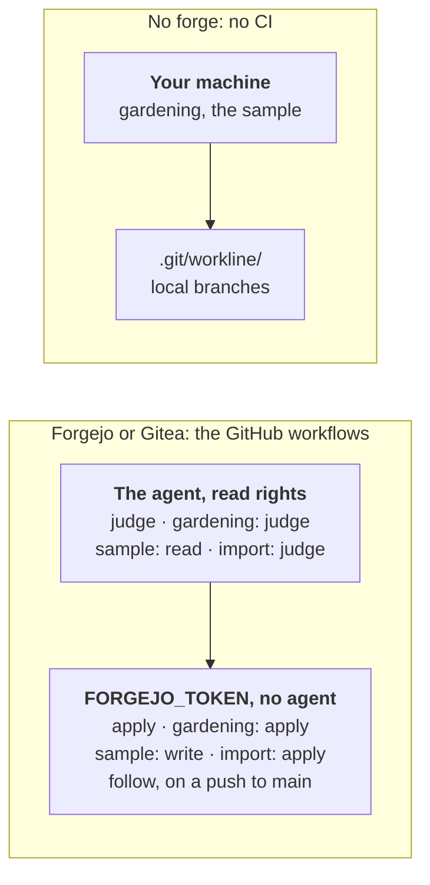

# workline on another forge, or none



What the jobs are, on every forge: [ci.md](ci.md). GitHub and GitLab are
spoken natively: [ci-github.md](ci-github.md), [ci-gitlab.md](ci-gitlab.md).

## Gitea, Forgejo, Codeberg…

Another forge is plugged by a command that answers its small contract, one
JSON request per operation ([forge-command.md](spec/forge-command.md)).

- **Forgejo and Gitea**, whose API has GitHub's shape: copy
  [ci/forgejo/workline-forge.sh](../ci/forgejo/workline-forge.sh) into the
  repository and name it in `.workline/config.yaml`:

  ```yaml
  forge: 'cmd:sh ci/forgejo/workline-forge.sh'
  ```
- It needs `curl` and `jq`, and:
  - `FORGEJO_URL`;
  - `FORGEJO_TOKEN`: issues and pull requests, write; its user an
    administrator of the repository for the product owner, which asks who
    of a comment's authors may write;
  - `FORGEJO_REPO` (`owner/name`), unless `origin` names it.
- The engine pushes the branches itself, with the job's git credentials;
  the script does the rest.
- **The jobs**: Forgejo Actions reads, largely, GitHub's workflow syntax.
  The [GitHub templates](ci-github.md) are a start: `--forge github`
  replaced by the command, the GitHub App's steps by `FORGEJO_TOKEN`.
- **Not tried yet** on a live instance — the script was run against a mock
  of the API only: tell us what differs.
- A forge of another shape: write the command the contract asks.

## No forge

A project with no forge — pushed to `main`, no merge request — keeps what
workline writes in its own clone:

```yaml
forge: local
```

- Issues and merge requests are files under `.git/workline/`, never
  committed; gardening's merge requests are local branches, nothing
  pushed.
- `workline issues` lists them, `workline issues show <n>` (or `!<n>` for a
  merge request) shows one; you merge a branch with git.
- No CI to set up: gardening and the [weekly sample](ci.md#the-weekly-sample)
  run on your machine — `workline route schedule --open-merge-request`,
  `workline sample --out sample.json` then `workline sample --apply
  sample.json` — and `workline docs` judges before a release.
- In CI — `CI`, `GITHUB_ACTIONS` or `GITLAB_CI` set — the local forge
  refuses its writes, loud: the job's clone is thrown away, and what it
  would hold with it. What writes nothing still runs, so a project whose
  config says `local` for its laptops passes `--forge` to its CI jobs that
  write.
- With `forge: none` (the default), nothing is written to a forge: a write
  that needs one — the issue a role opens included — is refused and says
  so, naming `forge: local`.
