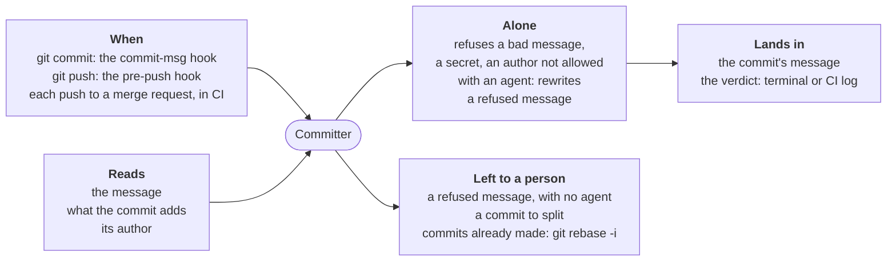

# Committer

For people: what the role does and how to set it. The AI never reads this
file. All roles: [docs/roles.md](../../docs/roles.md).

**Does**: checks each commit message (format, length, internal codes), the
secrets and forbidden terms a commit adds (gitleaks) and the author's
identity; with an agent, rewrites a refused message in your words.
**Does not**: check that a commit holds one change (planned:
[#192](https://github.com/JN0V/workline/issues/192)), split a commit, edit
code, rewrite commits already made (on a merge request it lists them, for
`git rebase -i`), or ask an agent about a message that passes.

| Event | Fired by | Checks |
|---|---|---|
| `commit-msg` | the global git hook (`workline hooks install --global`) | the message being written, what the commit adds |
| `pre-push` | the global hook, when `.workline/config.yaml` routes it | every commit pushed |
| `merge-request` | CI (`workline route merge-request --input range=<base>..<head>`) | every commit of the range |

## Settings

Under `roles: {committer: {settings: …}}` in `.workline/config.yaml`
([config reference](../../docs/config.md)); defaults from role.yaml:

| Key | Default | |
|---|---|---|
| `subject-max` | `72` | characters in the subject |
| `body-max-lines` | `12` | body lines, comments, blanks and trailers aside |
| `types` | `feat fix docs test refactor perf build ci chore revert` | allowed types |
| `internal-codes` | `\b[A-Z]{1,4}(-NEW)?-[0-9]+\b` | codes refused in the subject |
| `internal-codes-maybe` | `\b[A-Za-z]{1,3}[0-9]{2,}\b` | codes with no dash, judged |
| `internal-codes-allow` | `UTF-8`, `SHA-256`, `RFC-…`, `CVE-…`, `v1`… | standard names that look like codes |
| `allowed-identities` | `[]` | author addresses allowed, as patterns; empty with no user list: not checked |

`enforce: {<rule>: warn}` (or `off`) beside `settings` softens one rule.

**Outputs**: the verdict on the terminal or in the job's log; `--json`,
`--sarif`, `--code-quality` in CI. It writes nothing to a forge.
**Cost**: no call when the message passes; one call of a light model,
effort low, per refused message, and one more of a stronger model if the
rewrite is refused (`promote-after: 1`). No cap needed.
**Status**: used daily on workline itself since 2026-09; tried with Claude
below.

## Check (`pre`, no AI)

On `commit-msg` (the git hook), the message being written; on `merge-request`
and `pre-push`, every commit of the range given as `--input range=<base>..<head>`
(the pre-push hook gives the commits being pushed).

| Rule | Refuses |
|---|---|
| `format` | a subject that does not read `type(scope): summary`, with a type from `types` |
| `blank-after-subject` | a second line that is not empty: git would read it as part of the subject |
| `subject-length` | a subject over `subject-max` characters (72) |
| `body-length` | a body over `body-max-lines` lines (12), not counting comments, blank lines and trailers |
| `internal-code` | a reference that means nothing outside the project (`AC-3`) in the subject; it belongs in a trailer (`Refs: AC-3`). `internal-codes-allow` lists standard identifiers that look like one (`SHA-256`, `RFC-1234`). The reviewer reads the same lists in the comments a change adds (roles/reviewer) |
| `possible-internal-code` | a code with no dash (`F207`, `internal-codes-maybe`), as often a public name (`ESP32`): the agent judges it, and may keep it; without AI it blocks; on commits already made, only a warning |

Messages git writes itself (`Merge …`, `Revert "…"`, `fixup! …`, `squash! …`,
`amend! …`) are not checked. A message that passes asks no agent.

### Secrets and forbidden terms

What the commit adds (on `commit-msg`) or every commit of the range is
scanned with [gitleaks](https://github.com/gitleaks/gitleaks), before the
message: no rewrite fixes a secret, so a `leak` blocks without asking the
agent, at its file and line. The message is scanned too (`gitleaks stdin`),
without what git strips from it (comments, the diff of `commit -v`): a `leak`
there names its line, and the agent is not asked either, since the message
would carry the match to it. A rewrite is scanned like the message it
replaces. The match is never printed. Without gitleaks, the commit goes on
and the verdict says so (`secrets-not-checked`).

gitleaks' own rules find secrets. Terms that must never reach a repository
are rules of the user's, in lists kept outside it, gitleaks taking the first
config it finds:

1. `GITLEAKS_CONFIG` or `GITLEAKS_CONFIG_TOML`, when set;
2. the repository's `.gitleaks.toml`, gitignored: this repository's terms,
   which may extend the common list (`[extend] path = "…"`);
3. the common list, `workline/gitleaks.toml` in the user's config folder
   (`~/.config/` on Linux), which extends gitleaks' rules
   (`[extend] useDefault = true`);
4. gitleaks' rules alone.

A rule's id is printed: name no term in it. gitleaks lets
its own config through, so the committer refuses a commit adding a private
`.gitleaks.toml` — gitignored, or a link — (`term-list-staged`); one a
project commits to share its allowlist is not private.

### Identity

An author or committer address outside the allow list blocks (`identity`):
the one git will record, on `commit-msg` — `git var`, so an address given for
one commit (`-c user.email`, `--author`) is caught too — and those of every
commit of the range. The list is the project's `allowed-identities` setting
(patterns; noreply addresses, for a public repository) and the user's own, one
pattern a line, in `workline/allowed-identities` in their config folder. Both
empty, identities are not checked, and nothing is said.

## Rewrite (the agent)

On `commit-msg`, a refused message goes to the agent with the findings and the
staged diff. It proposes one `commit-message`, or a `note` when the diff mixes
unrelated changes and the commit should be split. On `merge-request`, the
commits are already made: the verdict lists them, to fix with `git rebase -i`.

## Judge (`post`, no AI)

- The rewrite must pass the same checks, but `possible-internal-code`: the
  agent judged it.
- It must keep every trailer of the original (`Co-Authored-By:`, `Refs:`…), on
  its own line in the last paragraph (`trailer-dropped`).
- A rewrite keeps the author's type, scope and breaking mark, when the header
  was not what was refused; adding a scope the author left out is allowed
  (`header-changed`).
- One commit, one message: several proposals are refused (`several-messages`).
- A `note` ends the run as `human`: a person splits the commit.

A refused rewrite is asked once more, of a stronger model (`promote-after: 1`).
A rewrite that passes replaces the message, and the commit goes on; the hook
prints the message committed, since it is no longer the one you wrote.

## Without AI

A bad message still fails, with the findings; you rewrite it. The message is
kept in the file git named, so nothing typed is lost.

The global hook still hands over to the hooks installed before workline.

## Tried for real

On 2026-09-24, on four messages of this repository the hook had refused (three
subjects over 72 characters, one naming `ADR-0001`), replayed with each
commit's own diff and Claude (haiku):

- before the instruction asked to keep the author's words, the rewrites
  traded precise words for vague ones: "run the project's line in the
  templates" became "refactor templates to use line routing", "specify"
  became "test";
- after, twice in a row, every rewrite kept the type, the scope and the
  author's words, and only cut ("run the project's line in templates and on
  workline's pull requests"). One took a second attempt: the first was 73
  characters.

On 2026-10-06, a copy of a real repository (DomoticsCore) with its own
`core.hooksPath`, no agent:

- `tools/hooks/` without workline: `AC-3 fix the thing` was committed
  unchecked; `workline doctor` said `hooks-bypassed` and printed the line to
  add. Added, the next commit was blocked (`internal-code`, `format`).
- `.githooks`: doctor printed `git config --local --unset core.hooksPath`;
  unset, the machine's global hooks blocked the same commit.
- Not tried: a hook that reads `pre-push`'s input after workline's line;
  husky or lefthook themselves; a work repository.
