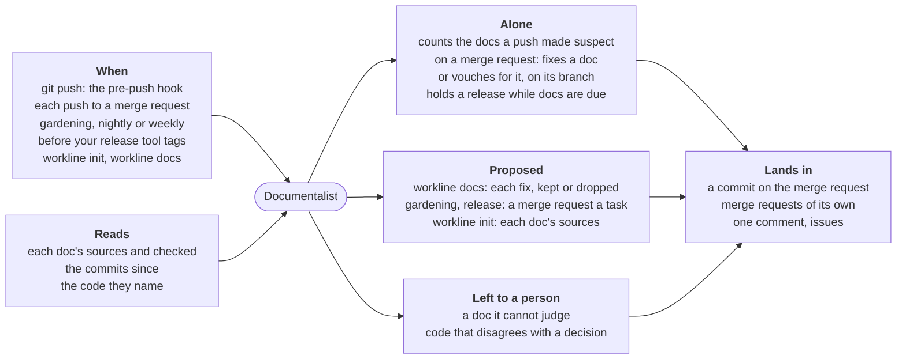

# Documentalist

For people: what the role does and how to set it. The AI never reads this
file. All roles: [docs/roles.md](../../docs/roles.md).

**Does**: keeps the docs true to the code they describe.

- A doc names its code in `sources`, and the commit it was last checked
  against in `checked`; a commit touching one of those sources makes the
  doc *suspect*.
- With no agent: finds the suspect docs, and checks sizes, duplicates, dead
  links, identifiers gone from the code, decisions superseded, derived
  blocks; when gardening, whether user pages serve their reader.
- With an agent: reads each suspect doc against its sources, and fixes it
  or vouches for it by moving `checked`; when gardening, it also reads
  stale docs again, merges repeated passages and condenses a doc over
  budget.

**Does not**: write code (its patches touch only `docs`), rewrite a doc the
code follows (`truth: doc`, decisions by default: it opens an issue
instead), fix what a change did not touch (other suspect docs wait for
gardening), commit on your machine without asking (`workline docs` asks,
doc by doc), or make a push wait on an agent.

| Event | Fired by | Does |
|---|---|---|
| `pre-push` | the global hook, when routed | counts the docs the pushed commits made suspect, no agent |
| `merge-request` | CI | judges the docs the merge request made suspect; fix committed to its branch |
| `schedule` | CI, nightly or weekly (gardening) | every suspect or stale doc, budgets, links, reader checks; one merge request per task |
| `release` | `workline route release`, before your release tool tags | holds the release until the docs due are judged |
| `init` | `workline init` | proposes each doc's `sources`, for you to review |

`workline docs` judges, on your machine, what was made suspect since the
last time, and asks you to keep or drop each change.

It needs the history back to each doc's `checked`: a shallow clone lacking
it gets `shallow-clone`, never a doc found suspect or passed by guess. The
CI templates fetch the whole history; elsewhere, `git fetch --unshallow`.

## Settings

Under `roles: {documentalist: {settings: …}}` in `.workline/config.yaml`
([config reference](../../docs/config.md)); defaults from role.yaml:

| Key | Default | |
|---|---|---|
| `docs` | `["docs/**", "*.md"]` | what is a doc; only these are ever patched |
| `truth` | `{doc: ["docs/adr/**"]}` | docs the code follows: an issue, never a rewrite |
| `propagation` | code → `docs/tech/**` now; `docs/tech/**` → `docs/product/**` at the release | which cascades wait |
| `budgets` | doc 200 lines, section 400 words, card 80–400 words, folder 2000 lines, `AGENTS.md` 200 lines | sizes reported |
| `freshness.stale-after-days` | `180` | a doc confirmed longer ago is read again |
| `reader` | user pages `README.md`, `docs/**` but specs; from `README.md`; paragraph 80 words, cell 30 | which pages a reader uses, and how much they read at once ([checks](docs/checks.md)) |
| `duplicates` | `{min-words: 40, similarity: 0.85}` | repeated passages |
| `derive` | `{}` | named commands filling `<!-- workline:derive name -->` blocks |
| `documented` | `[]` | code globs every file of which a doc must describe |
| `history`, `decisions` | `[]` | records and decision records beyond those known by name |
| `versions` | `{pattern: "", files: []}` | how the project writes a version, and where |
| `language` | `""` (read from each doc) | `en` or `fr` |
| `max-open-merge-requests` | `5` | gardening pauses while this many of its merge requests wait |
| `ai-max-calls` | `10` | suspect docs per call |
| `ai-max-tokens` | `0` (no cap) | tokens one run may spend, all calls together |
| `whole-chars` | `20000` | characters of sources a doc may take to be judged whole; 25000 at most, its task fitting the context budget |
| `judge-in-parts` | `false` | judge a doc too large in parts ([ADR-0009](../../docs/adr/0009-docs-far-behind-are-judged-in-parts.md)) |
| `parts-max`, `parts-max-per-run` | `8`, `16` | parts a doc, parts a run |
| `sample` | unset | `{judge, at-least, after}` for `workline sample` ([ci.md](../../docs/ci.md#the-weekly-sample)) |

## Outputs

- On your machine: one line at the push (`docs suspect: N`); `workline
  docs` proposes changes in the working tree, then one `docs:` commit.
- On a merge request: one comment listing what is left for a person, edited
  on each run; the fix committed to the branch (`Workline-Role:
  documentalist`); from a fork, the diff in a comment.
- Gardening: a branch and merge request per task,
  `workline/documentalist/<task>`; a tracking issue for docs due at the
  release; an issue when the code disagrees with a doc it follows.
- On a release tool's pull request: the fix on a merge request of its own,
  `workline/documentalist/release`, rebuilt on `main` each time `main`
  moves (`workline follow`, [ADR-0034](../../docs/adr/0034-the-release-fix-follows-its-base.md)), never over a person's commit.
- `--json`, `--sarif`, `--code-quality` for CI.

## Cost

A doc judged whole cost 13k to 26k tokens on a real repository; condensing
and splitting ask a frontier model (`model.tasks`). Caps: `ai-max-calls`,
`ai-max-tokens`, `whole-chars`, `parts-max-per-run`,
`max-open-merge-requests`. The weekly sample reads one doc in ten vouched
for, about 8k to 12k tokens a doc. A push costs nothing.

## Without AI

Every check still runs. Suspect docs are listed for a person, who clears
each by moving `checked` after reading it; on a merge request, in one
comment. Gardening only regenerates derived blocks.

## How it works

- [The checks](docs/checks.md): what `pre` finds with no AI, and their
  levels; [cascades](docs/cascades.md): how they are cut, what holds a
  release, the docs the code never rewrites.
- [The agent's tasks](docs/tasks.md): suspect docs judged whole or in parts;
  [gardening](docs/gardening.md): its tasks, one merge request per task.
- [The judge](docs/judge.md): what `post` refuses of the agent's patches;
  [its claims](docs/judge-claims.md): what backs a word taken out.
- [At the push, the release and the adoption](docs/push.md).

**Status**: beta, used on workline and DomoticsCore in CI;
[docs/status.md](docs/status.md), each try in [docs/tried.md](docs/tried.md).
