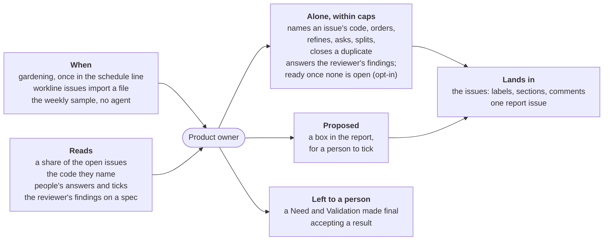

# Product owner



For people: what the role does and how to set it. The AI never reads this
file. All roles: [docs/roles.md](../../docs/roles.md). What a run does,
step by step: [docs/run.md](docs/run.md).

**Does**: keeps a project's backlog — its open issues — true to the code
and in order, between the need a person states and the result they accept
([ADR-0018](../../docs/adr/0018-the-product-owner.md)). A run reads a
share of the open issues against the code, acts within caps and
proposes the rest (below); it also keeps the one way every role opens an
issue.

**Does not**: write code or docs (`writes: []`: the forge's issues only),
write the Need or Validation of a person's issue as final, close as "not
planned", close a split need — a person accepts it —, undo a person's
priority, title or link, act alone on an issue whose need changed, move
a ready issue back to refine without a person's tick, or move an
issue to `ready` while a section is missing or a draft — nor, with the
reviewer after it in the line, while the reviewer has not read its spec
as it is or an important finding is open (#128, [below](#a-spec-read-before-ready)). What sets direction
it proposes rather than does at `autonomy: cautious`.

| Event | Fired by | Does |
|---|---|---|
| `schedule` | CI gardening, with `product-owner` in the `schedule` line | reads `issues-per-run` open issues, acts and proposes |
| `import` | `workline issues import <file>` (`--apply` to open; in CI, judged without `--apply`, then `workline apply --line`) | opens each item still to do in a file as an issue; then maps every item to its issue or the reason it has none, and lists what is left with neither, for a person (exit 2) |

## Alone, proposed, left to a person

At `autonomy: normal`, the default:

| | Acts |
|---|---|
| Alone | names an issue's code; sets milestones and priorities, at most 20% of the open issues moved a run; closes a duplicate, its original quoted; announces an obsolete issue, closes it a week later on silence and a second judge's yes; refines to `ready`, Need and Validation as drafts; asks the reporter what is missing; splits a need too big, then says on it what each part delivered ([ADR-0029](../../docs/adr/0029-a-parent-is-accepted-by-a-person-from-what-its-parts-delivered.md)); renames a vague title; says what an issue waits on, and takes off a link it set once its blocker closes ([ADR-0028](../../docs/adr/0028-an-issue-names-what-it-waits-on.md)); imports a roadmap file as issues |
| Proposed | moves past the 20%; an outsider's issue made `ready`; the issues built on a Need, a Scope or a roadmap line a person changed, a ready one back to refine included ([ADR-0032](../../docs/adr/0032-a-changed-need-flags-the-issues-built-on-it.md)); a link it set taken off while its blocker is open; at `cautious`, what sets direction: milestones, priorities, duplicates, splits, titles, dependencies, the drafts |
| Left to a person | a draft made final (`workline:accepted`); a split need accepted, by closing it; a box ticked; closing as not planned; undoing an act |

## A spec read before ready

Opt-in: the reviewer after the product owner in the gardening line
(`schedule: [documentalist, product-owner, reviewer]`, #128,
[ADR-0020](../../docs/adr/0020-the-reviewer-finds-the-engine-verifies-the-person-merges.md)).
The reviewer reads one refined issue a run and keeps its findings in a
comment on it ([reviewer](../reviewer/README.md#a-spec-on-the-forge)).

- **Held**: `ready` waits — the agent's, an accepted draft's, a ticked
  box's alike, at every autonomy level — while the reviewer has not read
  the body as it is (`spec-not-reviewed`), an important finding is open
  (`spec-findings-open`), or its rounds are spent (`spec-rounds-spent`).
- **Answered**: the next run reads the issue again and gives the agent
  the findings; a `refine` rewrites the sections they lie in that are the
  role's own — a draft, or a text as the role wrote it (the state's
  `wrote`) —, never a person's: for those it asks the reporter.
- **Released**: once the reviewer read the body as it is and found no
  important finding open, the engine moves it to ready, with no agent.
- **A person decides** at any round: `workline:accepted` lifts the hold,
  `workline:ready` set by hand is theirs.

## Settings

Under `roles: {product-owner: {settings: …}}` in `.workline/config.yaml`
([config reference](../../docs/config.md)). Each act's `mode` is `act`
(done, up to `max` a run), `propose` (a box in the report, for a person) or
`off`. The defaults are the `normal` level; `autonomy` lays another level
under the project's own settings, which win field by field:

| Key | `normal` (default) | `cautious` | `enterprising` |
|---|---|---|---|
| `issues-per-run` | `8` | | |
| `code-lines-max` | `1500` | | |
| `ignored-runs-max` | `3` (1 to 20; 0 never pauses) | | |
| `next-max` | `5` (0 to 20; 0 lists none) | | |
| `stuck-days` | `14` (1 to 365) | | |
| `moved-percent-max` | `20` | `10` | `30` |
| `acts.open` | act, max 30 | | |
| `acts.sources` | act, max 10 | | |
| `acts.milestone` | act, max 10 | propose | |
| `acts.order` | act, max 10 | propose | max 15 |
| `acts.close-duplicate` | act, max 3 | propose | max 5 |
| `acts.close-obsolete` | act, max 3, `days: 7`, `exempt: [pinned, security]` | `days: 14` | max 5 |
| `acts.refine` | act, max 5 | `drafts: propose` | max 10 |
| `acts.ready` | act, max 5 | | max 10 |
| `acts.ask` | act, max 3, `rounds: 3` | max 2, `rounds: 2` | max 5 |
| `acts.split` | act, max 2 | propose | max 4 |
| `acts.rename` | act, max 5 | propose | max 10 |
| `acts.depend` | act, max 5 | propose | max 10 |

An empty cell is the `normal` value. `cautious` suits a project whose
Product Owner is a person (`workline init` asks): it keeps the acts that
check facts and proposes those that set direction. A kind a person undid
goes back to `propose`, whatever the level.

```yaml
roles:
  product-owner:
    settings:
      autonomy: cautious
      acts: {close-duplicate: {mode: propose}}
```

## Outputs

- One report issue, "Backlog — product owner". It opens with **Next** —
  the first `next-max` ready issues in the backlog's order that wait on
  nothing, never a split need, each with its milestone and priority —
  and **Stuck** — each issue waiting on a person for more than
  `stuck-days`, with since when: ready with no pull request nor commit
  naming it since, its reporter not answering, a proposal of the report
  unticked, an announcement as obsolete past its delay with no second
  judge. Then what was done, what is proposed (a box a person of the
  project ticks; done at the next run), what waits on an open issue, the
  split needs whose parts are all closed, to accept, and the **Changed
  needs**: each issue whose Need or Scope a person rewrote, or imported
  lines that changed, with the issues built on it — read again, or to
  check — and what is proposed for each; tick its box once checked.
- On each issue it reads: a state comment; labels (`workline:priority/N`,
  `workline:draft`, `workline:obsolete`, `workline:ready`); milestones;
  sections written; a comment to an outsider reporter; sub-issues or tasks;
  GitHub's dependencies or GitLab's `is_blocked_by` links (Premium), else a
  line `Blocked by #12.` in the body — a link it set taken off once its
  blocker closes.
- On a split need: one comment, edited in place, listing its parts — open,
  closed as completed with the pull request or commit that closed it, or
  not delivered — and each item of its Verification, proved where a part
  delivered quotes it and a test it names is in the code, or not proved.
  Accept the need by closing it.
- `--json`, `--sarif`, `--code-quality` like any role.
- Each week, with the docs' sample (`workline sample --apply`, no agent):
  one in ten of the acts it did alone that week, on the issue "workline:
  the weekly sample of the product owner's acts" — each with its day, the
  level it was done at, and whether a person undid it — for you to judge:
  undo one you find wrong on its issue. From the acts undone it may
  suggest another level — its report says it too, beside the one from
  the proposals you settled; it never changes the setting.

A person accepts drafts with the label `workline:accepted`, on one issue or
many: the next run moves them to `ready`, with no agent.

## Cost

One call a run (standard tier, context budget 120k tokens, estimated): 45k
to 62k tokens in for four issues on a real backlog, up to 97.6k with their
code; `issues-per-run` and `code-lines-max` size it. A closing as obsolete asks a
second judge of another model. A split need's report costs no tokens:
one or two forge calls a part closed. Three runs in a row with nobody answering
(`ignored-runs-max`) pause the role: no agent is asked until a person ticks
a box, writes on the report or undoes an act.

## Without AI

Nothing is judged: each issue taken gets its state comment; accepted drafts
(`workline:accepted`), ticked boxes and an `agreed` reply are still done;
an issue whose milestone was released moves to the next; the backlog's
order and what waits are still said, the report's Next and Stuck
rebuilt, a split need's parts reported, and a changed need's issues
listed for a person.

**Status**: beta, nightly in DomoticsCore's CI and on workline's own
issues; [docs/status.md](docs/status.md), each try in [docs/tried.md](docs/tried.md).
