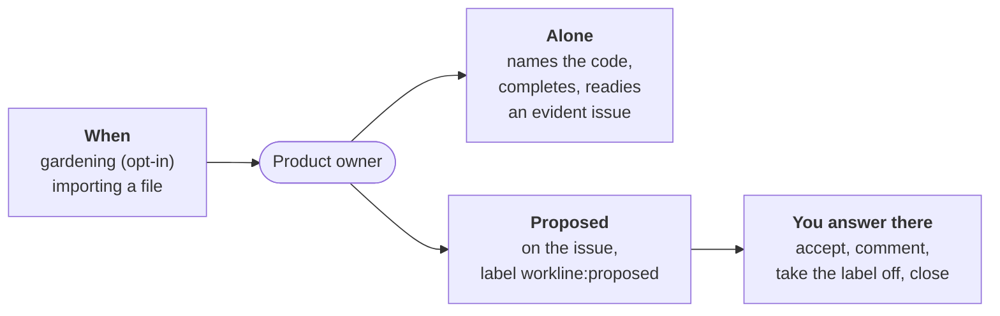

# Product owner



For people: what the role does and how to set it. The AI never reads this
file. All roles: [docs/roles.md](../../docs/roles.md). A run, step by
step: [docs/run.md](docs/run.md).

**Does**: keeps a project's open issues true to the code and ready to
build, between the need a person states and the result they accept
([ADR-0018](../../docs/adr/0018-the-product-owner.md)). What it proposes
is on each issue; you answer there
([ADR-0038](../../docs/adr/0038-the-product-owner-proposes-on-the-issue-a-person-answers-there.md)).

**Does not**:

- write code or docs (`writes: []`: the forge's issues only);
- write the Need or Validation of a person's issue as final;
- rewrite a section a person wrote, edited or deleted;
- move an outsider's issue to `ready`, nor one with a draft left;
- close as "not planned", or reopen an issue;
- keep a report issue, or any memory outside the issues.

## When

| Event | Fired by | Does |
|---|---|---|
| `schedule` | CI gardening, with `product-owner` in the `schedule` line | reads `issues-per-run` open issues, completes and proposes |
| `import` | `workline issues import <file>` | opens each item still to do in a file as an issue ([the command](../../docs/commands.md#workline-issues-import)) |

## On each issue

- **Its one comment**, created once, then edited in place: what it did,
  what it proposes, what it wants from you; what it knows of the issue,
  folded.
- **The label `workline:proposed`** (GitLab: `workline::proposed`) while
  the issue waits on you: its drafts, or a proposal.
- **What waits on you** is a saved filter on that label.
- **The night's summary** is in the CI job's summary: done, proposed,
  left to a person, read and left incomplete, next, stuck, one linked
  line an issue, in plain words
  ([what it writes](docs/outputs.md#in-the-ci-jobs-summary)).

## How you answer

| You want | You do | Next run |
|---|---|---|
| yes | label `workline:accepted` (bulk from the list) | does what it proposed, makes the drafts yours, moves it to `ready`; takes its label off |
| revise | a plain comment | 👀 on it, rewrites its own drafts in place, replies in one line |
| correct it yourself | edit the body | the sections you edited are yours, never rewritten; an edited draft counts as accepted |
| not now | take `workline:proposed` off | proposes nothing more on that issue until you edit it or comment |
| it should not exist | close it | never reopens it |

- **Silence is never a yes.** Past `proposals-max` issues waiting, the
  role reads only those you commented on.
- **Three rounds at most** (the draft, two revisions), then one line
  "left to a person" in the summary, nothing more on the issue.
- **Who counts**: the reporter and the project's people; their comment
  on any issue is read first. A bot's, a stranger's or a "+1" comment
  never brings an issue back.
- Accepting many issues from the list is quick: read what you accept.

## Alone or proposed

At `autonomy: normal`, the default:

- **Alone**: names an issue's code; completes it — Scope and Verification
  from the code, Need and Validation as drafts; asks its reporter what is
  missing; closes an evident duplicate; moves an evident issue to
  `ready` (four sections, none a draft).
- **Proposed** on the issue: past a cap a run; an outsider's issue to
  `ready`; an act whose only evidence is a stranger's comment.
- **Never invented**: an issue too thin, mixing topics or resting on a
  closed issue gets one plain question; one the code already does is
  said on it for you to close.
- **Written for a reader**: the person's part on top — a one-line Need,
  a real example, Given / When / Then scenarios —, the builder's below a
  line; plain words, a link for each decision cited, a closed issue said
  closed ([writing an issue](docs/writing.md),
  [what it writes](docs/outputs.md#on-each-issue)).
- **Undone by you** (`workline:ready` taken off, a closing reopened…):
  that kind is proposed on that issue from then on; undone `undone-max`
  times across the issues, on every issue.

## Settings

Under `roles: {product-owner: {settings: …}}` in `.workline/config.yaml`
([config reference](../../docs/config.md)); every key, with the off-by-default
acts: [docs/settings.md](docs/settings.md).

| Key | Default | Says |
|---|---|---|
| `autonomy` | `normal` | `cautious` notes and proposes; `enterprising` does more a run |
| `issues-per-run` | `8` | issues read a run |
| `proposals-max` | `10` | issues waiting on you before the role slows down |
| `undone-max` | `3` | acts of a kind undone before it is proposed everywhere |

```yaml
roles:
  product-owner:
    settings: {autonomy: cautious, issues-per-run: 5}
```

## Cost

- **One call a run** (standard tier, context budget 120k tokens,
  estimated): 45k to 62k tokens in for four issues on a real backlog, up
  to 97.6k with their code; `issues-per-run` and `code-lines-max` size it.
- A person's answer, an accepted proposal, an undo: read with no agent.

## Without AI

Nothing is judged, but each issue gets its state, accepted proposals and
an `agreed` reply are still done, labels follow your answers, and the
summary says what is next and stuck.

**Status**: [beta](../../docs/adr/0036-a-roles-status-is-earned-by-written-criteria.md), nightly on workline's own issues and in the CI of
another project of its author's; [docs/status.md](docs/status.md), each try in [docs/tried.md](docs/tried.md).
