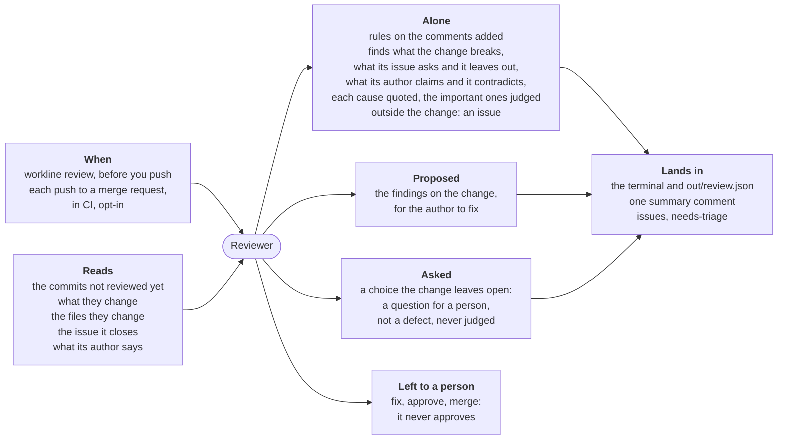

# Reviewer



For people: what the role does and how to set it. The AI never reads this
file. All roles: [docs/roles.md](../../docs/roles.md).

**Does**: reads the code a change brings before a person does, and says
what it breaks, what the issue it closes asks and it leaves out, and what
its author claims and it contradicts — each finding quoted, found again by
the engine and checked by a judge — and asks a person what only a person
decides; rules on the comments the change adds (a bug's story, an
internal code), with no agent.
**Does not**: approve, change the code, merge, or review docs and other
files that are not code (`ignore`): the author fixes, the person merges
(ADR-0020). A finding outside the change becomes an issue, never a comment
on the merge request.

| Event | Fired by | Reads |
|---|---|---|
| `review` | `workline review`, on your machine before you push | `base..HEAD`, every lens |
| `merge-request` | CI, opt-in: `workline init --review` adds it to the line | the commits not reviewed yet, one lens a push |

**Outputs**: on a machine, the findings and `out/review.json` for your
agent to fix; on a merge request, one summary comment edited each run, the
findings in `--sarif` / `--code-quality`, and an issue (`needs-triage`)
for each verified finding outside the change.
**Cost**: one call for the lenses (all of them on a machine, together;
one a push on a merge request) and one judge call for each important
finding. #146's eight commits, every lens: 142k tokens in, estimated, the
lenses' call 73.6k (430k before #147, docs/tried.md); the judges reading
whole functions (#127), about 160k. Intent and claims (#126): the
lenses' prompt 0.7% larger, 3.0% when the change closes an issue; a
decision for a person, 0.4% more, no judge call.
Caps:
`ai-max-tokens` (200000 a run), `diff-lines-max`, `code-lines-max`,
`judge-lines-max`, `tests-lines-max`, `testimony-lines-max`,
`issue-lines-max`, `findings-max`, `issues-max`, `questions-max`,
`lenses-per-push`.
**Without AI**: the rules alone; the change is left for a person
(`not-reviewed`).
**Status**: beta, released in v0.9.0; [docs/status.md](docs/status.md).

## A run

1. **The range.** `workline review`: `base..HEAD` (`base`, `--base`); on a
   merge request, the range CI gives. A change touching only what
   is not code (`ignore`) asks nobody.
2. **The rules**, on the comments the change adds, no agent: a story of
   the code (`bug-story`, `story-words`: "used to", "the bug was"); a code
   internal to the project (`internal-code`, by the committer's lists); a
   block over `comment-block-max` lines (`long-comment`, a warning). While
   a rule blocks, no agent is asked.
3. **The record.** Commits a review answered whole are not asked again;
   it is kept in the summary comment on a merge request,
   `.git/workline/reviewer-record` on a machine. New commits that change
   no code are recorded, nobody asked, the turn of the lenses kept.
4. **The lenses** (`lenses/<lens>.md`, a project's own in
   `.workline/roles/reviewer/lenses/`): correctness, edge cases, tests,
   intent, claims (#126). Every one on a machine; on a merge request one a push, in turn
   (`lenses-per-push`), every one with `--input lenses=all`.
   - **Together** (`lenses-together`, #147): the lenses of a run in one
     call, the change given once; each finding names its lens. One naming
     none is read as the first lens's, said (`finding-lens-unnamed`); one
     naming a lens not asked is dropped, said. `false`: a call each.
   - **What they read**: what the author says, as testimony: the
     messages of the commits not reviewed yet, whole, their trailers
     left, and the merge request's title and body
     (`testimony-lines-max`); each file they change once: whole, the
     change marked in it, while the files fit `code-lines-max`; the
     others by the change's hunks (`diff-lines-max`).
   - **Intent** (`needs: issue`): a change saying `Closes #4` (or
     `fixes`, `resolves`, `implements`), in a commit or the merge
     request, has #4 read from the forge, its Need, Verification and
     Scope given (`issue-lines-max`). The lens says what the issue asks
     and the change does not do or prove, its cause quoted from the issue
     (`path: "#4"`), and what the change does past the Scope. No issue
     closed: not asked, said in the summary; one that cannot be read:
     not asked, said (`issue-unread`).
   - **Claims** (`cites: claim`): each finding quotes the author's claim
     ("no change in behaviour"), found again in what they said, or is
     dropped (`finding-unfounded`), and its cause the line contradicting
     it.
   - **What they answer**: `finding`s: lens, severity, title, why, its
     cause quoted, its symptom when elsewhere, a fix; the claims lens's,
     the claim; a `decision`, the question for a person (step 6).
   - **The floor** (`finder-floor`): each lens is asked to look for a
     number of candidates first, from the change's size; a floor on
     candidates, never on what is judged or shown: a lens answering
     nothing leaves the review clean (`finder-floor-nothing-found-is-clean`).
5. **The quotes.** The engine finds each cause again, spaces and line
   breaks aside, in the file at the head of the range or among the lines
   the change removed, or in the issue it names (`#4`, the change's); a
   symptom, in its file; a claim, in what the author said. Not found: dropped, said
   (`finding-unfounded`). Two on one line are grouped, never one dropped
   (#229).
6. **Related or not.** A cause on a line the change added or removed, or
   on a kept line within three of a removal (a hunk taking away more lines
   than it adds, #224): the change's, reported on that line, for its
   author to fix. Elsewhere: an
   issue, once (ADR-0018: its key the file and the cause's line; held by
   an issue open or closed, none opened),
   labelled `needs-triage`, with the product owner's state; never on the
   merge request. A nit there is left, counted.
   - **A decision for a person** (#126): a finding holding `decision` —
     a trade-off, a design choice, what the issue leaves open — is a
     question, not a defect: its cause found again, in the change or its
     issue, else dropped, said, never an issue; never important, never
     judged, never blocking; one a line; `questions-max` a run, the rest counted.
     Asked in the summary comment under **Questions for a person**, one
     line each, its cause quoted; locally, `decision` (`question`). A
     reply on the merge request is enough: the reviewer does not wait.
7. **The judge**, apart, for each important finding, at the best
   independence (`judge-at-least`); its level and both models said. A no drops it, said (`finding-judged-no`).
   It reads the finding, the code it stands on, and what the change did
   within 40 lines of the cause (#147). The code (#127), found with no
   build ([research](../../docs/research/code-navigation.md)), up to
   `judge-lines-max` lines all together, the rest named with where it lies:
   - the function the cause lies in, whole (the symptom's too); none
     found, or longer than the cap, the 31 lines around it;
   - then, each whole while it fits: the functions the finding names, those
     the cause's function calls, those calling it, and last a capitalised
     word opening a sentence that names a function;
   - Go by its own parser, an unexported name looked for in its package
     only; shell, Python, Ruby, Lua and C-like files (C, C++, Java, C#,
     JavaScript, TypeScript, Rust, Kotlin, Swift, PHP, Scala, Dart) by a
     definition pattern and braces, indentation or `end`; references by
     `git grep -w` at the head; a name defined in the cause's file first,
     then its folder; in more than two other places, named, none shown;
     test files left to the tests judge.

   Its question is the lens's (the
   front matter of `lenses/<lens>.md`), else whether the quoted code fails:
   - correctness, edge cases: whether the code quoted fails as the finding says;
   - tests (#223): whether a test exercises the behaviour and would fail
     were it wrong, the judge shown the test files (`tests`) in the cause's
     folder and those naming its file, whole up to `tests-lines-max`, the
     rest named; a no names the test.
   - intent (#126): whether the issue asks what the change does not do,
     or the change does what the Scope leaves out; the judge shown the
     issue, and for a cause in the issue the whole merge request's change,
     commits reviewed before included, up to `code-lines-max` lines: a
     part an earlier push did is refused, not reported missing;
   - claims (#126): whether the code quoted contradicts the claim quoted.
   - Two findings on one line are each judged by their own lens's
     question (#229); a refused one is dropped alone, the rest still shown.
8. **The verdict.** The rules block (the long comment warns); what the
   lenses find warns (`ai-findings: warn`) until the evaluation has
   measured it (#90), lens by lens (Settings); a question for a person
   neither warns nor blocks, the summary counting it. Past `findings-max` on the
   change, or `issues-max` outside it, the rest is counted. One summary
   comment on a merge request, edited each run (`forge-writes`); none
   when the run blocks.

A lens whose answer does not read is asked again once, with what the YAML
reader said (`promote-after`). A lens that fails is said (`lens-failed`),
the commits left unrecorded. An
agent unreachable: `blocked-external`. No agent: the rules alone, the change
left for a person (`not-reviewed`).

## The budget

- **`ai-max-tokens`**, 200000 a run: once spent, nothing more is asked,
  said (`ai-max-tokens`); the call that crosses it is paid.
- **Not whole**: a lens not asked, or a finding not judged
  (`review-not-whole`), leaves the commits unrecorded, reviewed again
  next run.
- **Said**: the summary gives the tokens used against the cap; each
  call's, by lens and by judged finding, is in `out/review.json`.
- **A call**: `context.budget`, 100000 tokens, estimated 711 + 0.82 a
  character before the call (#235); a larger prompt is not sent, the
  lens failing, said (`lens-failed`).

## On a machine

```sh
workline review                 # main..HEAD, every lens
workline review --base develop --lenses correctness --json
```

The findings are printed, then the tokens each call used: the lenses',
each judge's with its finding's place. The run's `out/review.json` (its
path printed, or `--json`) gives them to the author's agent: each with its
place, its cause quoted, whether it is the change's, and how it was
verified; and what each call used (`calls`).

## On a merge request

`workline init --review` adds the reviewer to the project's merge-request
line. The judging job reads the summary comment, to know what was reviewed:
on GitHub it needs a read token (`GH_TOKEN`, `pull-requests: read`), which
ci/github/workline.yml gives it.

- **A blocked merge request still gets the comment** (#226): what blocks
  first, marked `**blocks**`, then the warnings; the issues outside the
  change opened as on a pass (role.yaml's `on-block`).
- **The record moves** as on a pass when every lens answered: the next
  push reviews only the new commits. A rule that blocks writes the comment
  too, the record left as it was: no lens ran.
- **The job still fails**: the judging job by the verdict, while the
  applying one writes the comment (`if: always()`, `when: always`).

## Settings

Under `roles: {reviewer: {settings: …}}` in `.workline/config.yaml`
([config reference](../../docs/config.md)); defaults from role.yaml:

| Key | Default | |
|---|---|---|
| `base` | `main` | where `workline review` starts without `--base` |
| `ignore` | `*.md`, `docs/**`, `LICENSE*`, `**/*.txt`, `CHANGELOG*` | not code: a change touching only these asks nobody |
| `lenses` | `[correctness, edge-cases, tests, intent, claims]` | in this order, in turn, on a merge request; a lens with nothing to read (intent, no issue closed) skipped |
| `lenses-per-push` | `1` | `--input lenses=all` asks every one |
| `findings-max` | `10` | findings on the change a run; the rest counted |
| `issues-max` | `3` | issues opened a run for what lies outside it |
| `questions-max` | `3` | decisions put to a person a run (#126); the rest counted |
| `diff-lines-max` | `1500` | lines of the change a lens is given |
| `code-lines-max` | `600` | lines of the changed files a lens is given whole, the change marked; the others by their hunks |
| `lenses-together` | `true` | the lenses of a run in one call; `false`: a call each |
| `judge-lines-max` | `200` | lines of code a judge is shown: the cause's function, then those it reaches (#127), the rest named; `0`: the 31 lines around the cause |
| `tests-lines-max` | `300` | lines of tests a tests-lens judge is shown, the rest named |
| `testimony-lines-max` | `80` | lines of what the author says (commit messages, the merge request) the lenses are given |
| `issue-lines-max` | `80` | lines of the issues the change closes (Need, Verification, Scope) the lenses are given |
| `ai-max-tokens` | `200000` | tokens a run may spend, in and out, all calls; the call crossing it is paid; `0`: no cap |
| `comment-block-max` | `8` | lines of one added comment (`long-comment`, a warning) |
| `story-words` | `used to`, `the bug was`, `previously` | a comment telling the code's history |
| `ai-findings` | `warn` | `block`: a verified important finding blocks; by lens, `{correctness: block}`, a lens not named warning, of findings on one line, a verified one from a blocking lens leading |
| `judge-at-least` | `context` | `model` or `provider`: the judge's independence |
| `forge-writes` | `true` | `false`: no summary comment nor issue, the verdict only |
| `finder-floor` | `true` | each lens looks for a number of candidates from the change's size; never a floor on what is judged or shown |
| `tests` | `**/*_test.*`, `**/test_*`, `**/*.spec.*`, `**/tests/**`, … | the test files a tests-lens judge is shown |
