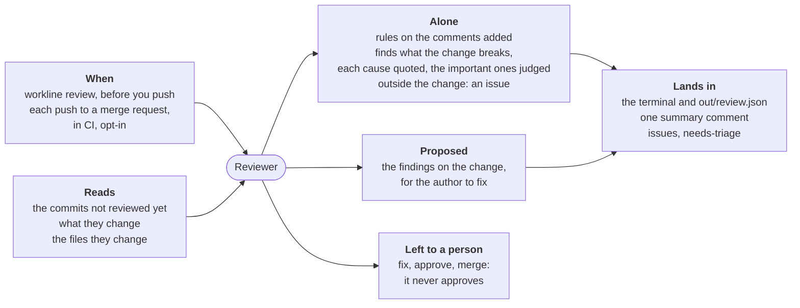

# Reviewer



For people: what the role does and how to set it. The AI never reads this
file. All roles: [docs/roles.md](../../docs/roles.md).

**Does**: reads the code a change brings before a person does, and says
what it breaks — each finding quoted, found again by the engine and checked
by a judge; rules on the comments the change adds (a bug's story, an
internal code), with no agent.
**Does not**: approve, change the code, merge, or review docs and other
files that are not code (`ignore`): the author fixes, the person merges
(ADR-0020). A finding outside the change becomes an issue, never a comment
on the merge request.

| Event | Fired by | Reads |
|---|---|---|
| `review` | `workline review`, on your machine before you push | `base..HEAD`, every lens |
| `merge-request` | CI, opt-in: `workline init --review` adds it to the line | the commits not reviewed yet, one lens a push |

**Outputs**: on a machine, the findings and `out/review.json` for your
agent to fix; on a merge request, one summary comment edited each run, the
findings in `--sarif` / `--code-quality`, and an issue (`needs-triage`)
for each verified finding outside the change.
**Cost**: one call a lens (three on a machine, one a push on a merge
request) and one judge call for each important finding; measured from 2k
to 51k tokens in for a lens, 3k to 8k for a judge (docs/tried.md). Caps:
`diff-lines-max`, `code-lines-max`, `findings-max`, `issues-max`,
`lenses-per-push`.
**Without AI**: the rules alone; the change is left for a person
(`not-reviewed`).
**Status**: beta, released in v0.9.0; [docs/status.md](docs/status.md).

## A run

1. **The range.** `workline review`: `base..HEAD` (`base`, `--base`); on a
   merge request, the range CI gives. A change touching only what
   is not code (`ignore`) asks nobody.
2. **The rules**, on the comments the change adds, no agent: a story of
   the code (`bug-story`, `story-words`: "used to", "the bug was"); a code
   internal to the project (`internal-code`, by the committer's lists); a
   block over `comment-block-max` lines (`long-comment`, a warning). While
   a rule blocks, no agent is asked.
3. **The record.** Commits a review answered whole are not asked again;
   it is kept in the summary comment on a merge request,
   `.git/workline/reviewer-record` on a machine. New commits that change
   no code are recorded, nobody asked, the turn of the lenses kept.
4. **The lenses**, each a part of the question in a context of its own
   (`lenses/<lens>.md`, a project's own in `.workline/roles/reviewer/lenses/`):
   correctness, edge cases, tests. Every one on a machine; on a merge
   request one a push, in turn (`lenses-per-push`), every one with
   `--input lenses=all`. Each gets the commits not reviewed yet (their
   messages as claims), what they change, and the files they change, to
   read whole; it answers `finding`s: severity, title, why, its cause quoted,
   its symptom when elsewhere, a fix.
5. **The quotes.** The engine finds each cause again, spaces and line
   breaks aside, in the file at the head of the range or among the lines
   the change removed; a symptom, in its file. Not found: dropped, said
   (`finding-unfounded`). Two on one line are merged, the second said.
6. **Related or not.** A cause on a line the change added or removed, or
   on a kept line within three of a removal (a hunk taking away more lines
   than it adds, #224): the change's, reported on that line, for its
   author to fix. Elsewhere: an
   issue, once (ADR-0018: its key the file and the cause's line; held by
   an issue open or closed, none opened),
   labelled `needs-triage`, with the product owner's state; never on the
   merge request. A nit there is left, counted.
7. **The judge**, apart, for each important finding, at the best
   independence (`judge-at-least`); its level and both models said. A no drops it, said (`finding-judged-no`).
   It reads the finding, the code around its cause and symptom, and what
   the change did to the cause's file. Its question is the lens's (the
   front matter of `lenses/<lens>.md`), else whether the quoted code fails:
   - correctness, edge cases: whether the code quoted fails as the finding says;
   - tests (#223): whether a test exercises the behaviour and would fail
     were it wrong, the judge shown the test files (`tests`) in the cause's
     folder and those naming its file, whole up to `code-lines-max`, the
     rest named; a no names the test.
   - Two findings on one line are judged once, by the leading lens's question.
8. **The verdict.** The rules block (the long comment warns); what the
   lenses find warns (`ai-findings: warn`) until the evaluation has
   measured it (#90), lens by lens (Settings). Past `findings-max` on the
   change, or `issues-max` outside it, the rest is counted. One summary
   comment on a merge request, edited each run (`forge-writes`); none
   when the run blocks.

A lens whose answer does not read is asked again once, with what the YAML
reader said (`promote-after`). A lens that fails is said (`lens-failed`),
the commits left unrecorded. An
agent unreachable: `blocked-external`. No agent: the rules alone, the change
left for a person (`not-reviewed`).

## On a machine

```sh
workline review                 # main..HEAD, every lens
workline review --base develop --lenses correctness --json
```

The findings are printed; the run's `out/review.json` (its path printed, or
`--json`) gives them to the author's agent: each with its place, its cause
quoted, whether it is the change's, and how it was verified.

## On a merge request

`workline init --review` adds the reviewer to the project's merge-request
line. The judging job reads the summary comment, to know what was reviewed:
on GitHub it needs a read token (`GH_TOKEN`, `pull-requests: read`), which
ci/github/workline.yml gives it.

- **A blocked merge request still gets the comment** (#226): what blocks
  first, marked `**blocks**`, then the warnings; the issues outside the
  change opened as on a pass (role.yaml's `on-block`).
- **The record moves** as on a pass when every lens answered: the next
  push reviews only the new commits. A rule that blocks writes the comment
  too, the record left as it was: no lens ran.
- **The job still fails**: the judging job by the verdict, while the
  applying one writes the comment (`if: always()`, `when: always`).

## Settings

Under `roles: {reviewer: {settings: …}}` in `.workline/config.yaml`
([config reference](../../docs/config.md)); defaults from role.yaml:

| Key | Default | |
|---|---|---|
| `base` | `main` | where `workline review` starts without `--base` |
| `ignore` | `*.md`, `docs/**`, `LICENSE*`, `**/*.txt`, `CHANGELOG*` | not code: a change touching only these asks nobody |
| `lenses` | `[correctness, edge-cases, tests]` | in this order, in turn, on a merge request |
| `lenses-per-push` | `1` | `--input lenses=all` asks every one |
| `findings-max` | `10` | findings on the change a run; the rest counted |
| `issues-max` | `3` | issues opened a run for what lies outside it |
| `diff-lines-max` | `1500` | lines of the change a lens is given |
| `code-lines-max` | `1200` | lines of the changed files a lens is given |
| `comment-block-max` | `8` | lines of one added comment (`long-comment`, a warning) |
| `story-words` | `used to`, `the bug was`, `previously` | a comment telling the code's history |
| `ai-findings` | `warn` | `block`: a verified important finding blocks; by lens, `{correctness: block}`, a lens not named warning, the blocking one leading two findings on one line |
| `judge-at-least` | `context` | `model` or `provider`: the judge's independence |
| `forge-writes` | `true` | `false`: no summary comment nor issue, the verdict only |
| `finder-floor` | `true` | each lens looks for a number of candidates from the change's size |
| `tests` | `**/*_test.*`, `**/test_*`, `**/*.spec.*`, `**/tests/**`, … | the test files a tests-lens judge is shown |
