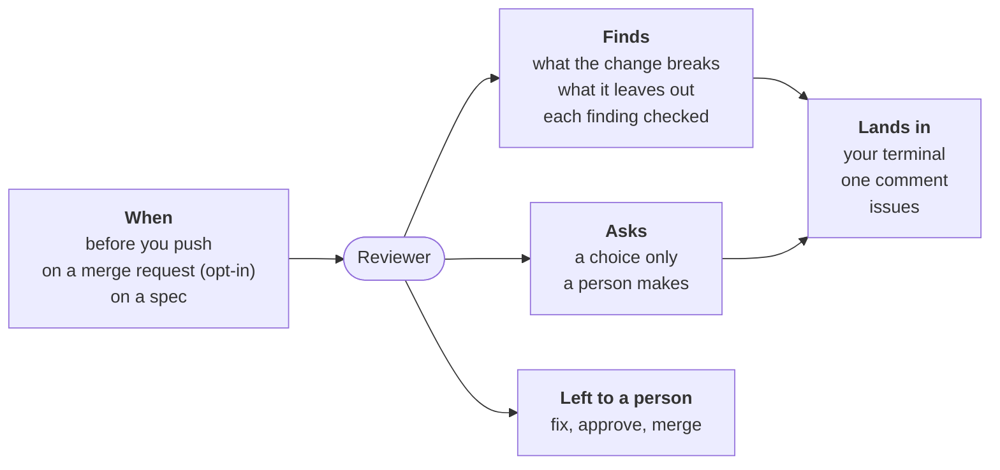

# Reviewer



For people: what the role does and how to set it. The AI never reads this
file. All roles: [docs/roles.md](../../docs/roles.md).

**Does**:

- reads the code a change brings before a person does, and says what it
  breaks, what the issue it closes asks and it leaves out, and what its
  author claims and it contradicts;
- quotes each finding; the engine finds the quote again, and a second AI
  call (the judge) checks each important one;
- asks a person what only a person decides;
- rules on the comments the change adds (a bug's story, an internal code),
  with no agent;
- reads a spec before it is built too, a file or an issue: what is
  ambiguous, unverifiable, out of its scope, or contradicted by the code;
  on the forge, after the product owner refines an issue, its findings
  hold the issue from `ready` ([a spec](docs/spec.md)).

**Does not**:

- approve, change the code or merge: the author fixes, the person merges
  ([ADR-0020](../../docs/adr/0020-the-reviewer-finds-the-engine-verifies-the-person-merges.md));
- review docs and other files that are not code (`ignore`);
- comment on the merge request for a finding outside the change: that
  becomes an issue.

## When, what it costs

| Event | Fired by | Reads |
|---|---|---|
| `review` | `workline review`, on your machine before you push | `base..HEAD`, every lens |
| `merge-request` | CI, opt-in: `workline init --review` adds it to the line | the commits not reviewed yet, one lens a push |
| `spec` | `workline review --spec <file>` or `--issue <n>` | the spec, every spec lens |
| `schedule` | CI gardening, opt-in: `reviewer` after `product-owner` in the `schedule` line | one issue the product owner refined, every spec lens |

- **Outputs**: on a machine, the findings and `out/review.json` for your
  agent to fix; on a merge request, one summary comment edited each run,
  the findings for GitHub's code scanning or GitLab's Code Quality
  (`--sarif`, `--code-quality`), and an issue (`needs-triage`) for each
  verified finding outside the change.
- **Cost**: one call for the lenses (all of them on a machine, together;
  one a push on a merge request), one judge call for each important
  finding; a spec, one call. Capped at 200000 tokens a run
  (`ai-max-tokens`) and by the `*-max` settings below. Measured:
  [status](docs/status.md#cost-measured).
- **Without AI**: the rules alone; the change is left for a person
  (`not-reviewed`).
- **Status**: [beta](../../docs/adr/0036-a-roles-status-is-earned-by-written-criteria.md), released in v0.9.0; [where it stands](docs/status.md),
  [each try](docs/tried.md).

## A run, in short

Step by step, with every rule: [a run on code](docs/run.md).

1. **The range**: `base..HEAD` on a machine, CI's range on a merge
   request; a change that is not code asks nobody.
2. **The rules** on the comments added, with no agent; while one blocks, no
   agent is asked.
3. **The record**: commits already reviewed whole are not asked again.
4. **The lenses**: correctness, edge cases, tests, intent (the issue the
   change closes), claims (what its author says), in one call; a project
   adds its own in `.workline/roles/reviewer/lenses/`.
5. **The quotes**: each cause found again in the code, the issue or the
   author's words; not found, dropped.
6. **Whose finding**: a cause in the change goes to its author; elsewhere,
   to an issue; a choice for a person is asked as a question.
7. **The judge**: each important finding checked apart, reading the code
   it stands on; a no drops it ([more](docs/judge.md)).
8. **The verdict**: rules block; findings warn until measured
   (`ai-findings`); one summary comment on a merge request.

The run's tokens are capped and said ([the budget](docs/judge.md#the-budget)).

## On a machine

```sh
workline review                 # main..HEAD, every lens
workline review --base develop --lenses correctness --json
workline review --spec docs/x.md    # a spec before it is built
```

The findings are printed with the tokens each call used; `out/review.json`
gives them to your agent ([more](docs/run.md#on-a-machine)).

## On a merge request

`workline init --review` adds the reviewer to the project's merge-request
line. On GitHub the judging job needs a read token (`GH_TOKEN`,
`pull-requests: read`), which the [template](../../ci/github/workline.yml)
gives it. A blocked merge request still gets the comment
([more](docs/run.md#on-a-merge-request)).

## Settings

Under `roles: {reviewer: {settings: …}}` in `.workline/config.yaml`
([config reference](../../docs/config.md)); defaults from role.yaml:

| Key | Default | |
|---|---|---|
| `base` | `main` | where `workline review` starts without `--base` |
| `ignore` | `*.md`, `docs/**`, `LICENSE*`, `**/*.txt`, `CHANGELOG*` | not code: a change touching only these asks nobody |
| `lenses` | `[correctness, edge-cases, tests, intent, claims]` | in this order, in turn, on a merge request; a lens with nothing to read skipped |
| `lenses-per-push` | `1` | `--input lenses=all` asks every one |
| `lenses-together` | `true` | the lenses of a run in one call; `false`: a call each |
| `diff-alone` | `false` | `true`: one more call, given the change only |
| `spec-lenses` | `[ambiguous, unverifiable, out-of-scope, contradicted]` | the lenses a spec is read through |
| `spec-rounds` | `5` | on the forge: reviews in a row leaving a finding open, then a question to a person (1 to 20) |
| `comment-block-max` | `8` | lines of one added comment (`long-comment`, a warning) |
| `story-words` | `used to`, `the bug was`, `previously` | a comment telling the code's history |
| `ai-findings` | `warn` | `block`: a verified important finding blocks; by lens, `{correctness: block}` (below) |
| `judge-at-least` | `context` | `model` or `provider`: the judge's independence |
| `forge-writes` | `true` | `false`: no summary comment nor issue, the verdict only |
| `finder-floor` | `true` | each lens looks for a number of candidates first; never a floor on what is shown |
| `tests` | `**/*_test.*`, `**/test_*`, `**/*.spec.*`, `**/tests/**`, … | the test files a tests-lens judge is shown |

- **`ai-findings` by lens**: a lens not named warns; of findings on one
  line, a verified one from a blocking lens leads.
- **`lenses`**: intent has nothing to read when the change closes no issue,
  and is skipped.

### Caps

What a run may read and write, and spend:

| Key | Default | |
|---|---|---|
| `findings-max` | `10` | findings on the change a run; the rest counted |
| `issues-max` | `3` | issues opened a run for what lies outside it |
| `questions-max` | `3` | questions put to a person a run; the rest counted |
| `diff-lines-max` | `1500` | lines of the change a lens is given |
| `code-lines-max` | `600` | lines of changed files a lens is given whole; the others by their hunks |
| `judge-lines-max` | `200` | lines of code a judge is shown, the rest named; `0`: the 31 lines around the cause |
| `tests-lines-max` | `300` | lines of tests a tests-lens judge is shown |
| `testimony-lines-max` | `80` | lines of what the author says (commit messages, the merge request) |
| `issue-lines-max` | `80` | lines of the issues the change closes (Need, Verification, Scope) |
| `ai-max-tokens` | `200000` | tokens a run may spend, all calls; the call crossing it is paid; `0`: no cap |
| `spec-lines-max` | `300` | lines of a spec given; the rest cut, said |

