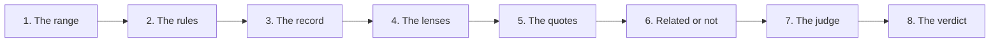

# Reviewer — a run on code

Part of [the reviewer](../README.md): what a review of a change does, step
by step. A spec is read the same way, with lenses of its own:
[a spec](spec.md). Steps 7 and 8, and what a run may spend: [the judge](judge.md).

## 1–3. The range, the rules, the record

1. **The range.** `workline review`: `base..HEAD` (`base`, `--base`); on a
   merge request, the range CI gives. A change touching only what is not
   code (`ignore`) asks nobody.
2. **The rules**, on the comments the change adds, no agent:
   - a story of the code (`bug-story`, `story-words`: "used to", "the bug
     was");
   - a code internal to the project (`internal-code`, by the committer's
     lists);
   - a block over `comment-block-max` lines (`long-comment`, a warning).

   While a rule blocks, no agent is asked.
3. **The record.** Commits a review answered whole are not asked again.
   - It is kept in the summary comment on a merge request,
     `.git/workline/reviewer-record` on a machine.
   - New commits that change no code are recorded, nobody asked, the turn
     of the lenses kept.

## 4. The lenses

The lenses (`lenses/<lens>.md`, a project's own in
`.workline/roles/reviewer/lenses/`): correctness, edge cases, tests,
intent, claims ([#126](https://github.com/JN0V/workline/issues/126)).
Every one on a machine; on a merge request one a push, in turn
(`lenses-per-push`), every one with `--input lenses=all`.

- **Together** (`lenses-together`,
  [#147](https://github.com/JN0V/workline/issues/147)): the lenses of a run
  in one call, the change given once; each finding names its lens. One
  naming none is read as the first lens's, said (`finding-lens-unnamed`);
  one naming a lens not asked is dropped, said. `false`: a call each.
- **What they read**:
  - what the author says, as testimony: the messages of the commits not
    reviewed yet, whole, their trailers left, and the merge request's
    title and body (`testimony-lines-max`);
  - each file they change once: whole, the change marked in it, while the
    files fit `code-lines-max`; the others by the change's hunks
    (`diff-lines-max`).
- **Intent** (`needs: issue`): a change saying `Closes #4` (or `fixes`,
  `resolves`, `implements`), in a commit or the merge request, has #4 read
  from the forge, its Need, Verification and Scope given
  (`issue-lines-max`).
  - The lens says what the issue asks and the change does not do or
    prove, its cause quoted from the issue (`path: "#4"`), and what the
    change does past the Scope.
  - No issue closed: not asked, said in the summary; one that cannot be
    read: not asked, said (`issue-unread`).
- **Claims** (`cites: claim`): each finding quotes the author's claim ("no
  change in behaviour"), found again in what they said, or is dropped
  (`finding-unfounded`), and its cause the line contradicting it.
- **What they answer**: `finding`s — lens, severity, title, why, its cause
  quoted, its symptom when elsewhere, a fix; the claims lens's, the claim;
  a `decision`, the question for a person (step 6).
- **The diff alone** (`diff-alone`, off,
  [#126](https://github.com/JN0V/workline/issues/126)): a call of its own,
  given the change only (`git diff -U3`, up to `diff-lines-max`), not the
  files, the messages nor the issue: what the change says by itself.
  - Its findings are quoted, judged and routed as a lens's.
  - `--lenses diff-alone` asks it alone, whatever the setting.
  - Off by measure: it found what the lenses found, nothing more
    ([tried](tried.md)).
- **The floor** (`finder-floor`): each lens is asked to look for a number
  of candidates first, from the change's size. A floor on candidates,
  never on what is judged or shown: a lens answering nothing leaves the
  review clean (`finder-floor-nothing-found-is-clean`).

## 5–6. The quotes, and whose finding it is

5. **The quotes.** The engine finds each cause again, spaces and line
   breaks aside: in the file at the head of the range, among the lines the
   change removed, or in the issue it names (`#4`, the change's); a
   symptom, in its file; a claim, in what the author said.
   - Not found: dropped, said (`finding-unfounded`).
   - Two on one line are grouped, never one dropped
     ([#229](https://github.com/JN0V/workline/issues/229)).
6. **Related or not.**
   - **The change's**: a cause on a line the change added or removed, or
     on a kept line within three of a removal (a hunk taking away more
     lines than it adds, [#224](https://github.com/JN0V/workline/issues/224)).
     Reported on that line, for its author to fix.
   - **Elsewhere**: an issue, once, labelled `needs-triage`, with the
     product owner's state; never on the merge request. Its key is the
     file and the cause's line; an issue open or closed holds it, none
     opened ([ADR-0018](../../../docs/adr/0018-the-product-owner.md)). A
     nit there is left, counted.
   - **A decision for a person**
     ([#126](https://github.com/JN0V/workline/issues/126)): a finding
     holding `decision` — a trade-off, a design choice, what the issue
     leaves open — is a question, not a defect.
     - Its cause found again, in the change or its issue, else dropped,
       said; never an issue.
     - Never important, never judged, never blocking; one a line (in an
       issue, one a quote); `questions-max` a run, the rest counted.
     - Asked in the summary comment under **Questions for a person**, one
       line each, its cause quoted; locally, `decision` (`question`).
     - A reply on the merge request is enough: the reviewer does not wait.

## On a machine

- The findings are printed, then the tokens each call used: the lenses',
  each judge's with its finding's place.
- The run's `out/review.json` (its path printed, or `--json`) gives them
  to the author's agent: each with its place, its cause quoted, whether
  it is the change's, and how it was verified; and what each call used
  (`calls`).

## On a merge request

`workline init --review` adds the reviewer to the project's merge-request
line. The judging job reads the summary comment, to know what was
reviewed: on GitHub it needs a read token (`GH_TOKEN`,
`pull-requests: read`), which
[ci/github/workline.yml](../../../ci/github/workline.yml) gives it.

- **A blocked merge request still gets the comment**
  ([#226](https://github.com/JN0V/workline/issues/226)): what blocks
  first, marked `**blocks**`, then the warnings; the issues outside the
  change opened as on a pass (role.yaml's `on-block`).
- **The record moves** as on a pass when every lens answered: the next
  push reviews only the new commits. A rule that blocks writes the comment
  too, the record left as it was: no lens ran.
- **The job still fails**: the judging job by the verdict, while the
  applying one writes the comment (`if: always()`, `when: always`).
